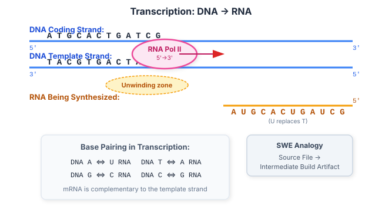
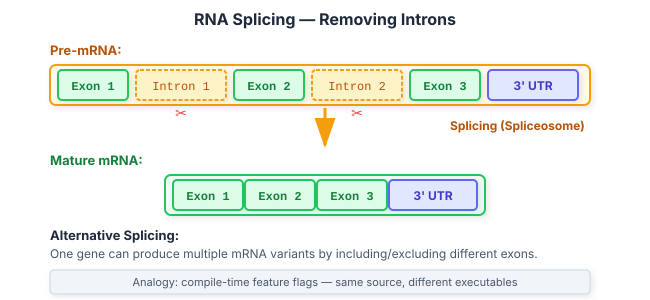

# 02 — RNA: The Transient Build Artifact

**Prerequisites:** `01-dna.md`

**See also:** `03-genes-chromosomes.md`, `04-central-dogma.md`

---

## The Big Idea

If DNA is the **permanent source repository**, RNA is a **temporary build artifact** — a single-stranded copy of a specific region, produced on demand and destroyed after use.

---

## 1. RNA vs DNA

| Property | DNA | RNA |
|----------|-----|-----|
| Sugar | Deoxyribose | Ribose |
| Strands | Double | Single |
| Bases | A, T, C, G | A, U, C, G |
| Stability | Very stable (years) | Fragile (minutes to hours) |
| Copy count | 2 copies per cell (diploid) | 1–many copies per gene |
| Role | Permanent storage | Transient messenger, worker |

The key difference at the sequence level:

```
DNA:    A  T  G  C
RNA:    A  U  G  C    (U replaces T)
```

```python
def dna_to_rna(dna: str) -> str:
    return dna.replace("T", "U")

assert dna_to_rna("ATGCTA") == "AUGCUA"
```

**Analogy:** DNA is the `git` repository on GitHub. RNA is a `cat` of one file, piped into a temporary file, consumed by a build process, then `rm`'d.

---



## 2. How RNA Is Made: Transcription

RNA is synthesized from a DNA template by the enzyme **RNA polymerase**.

```
DNA:   5' - A T G C T A G C - 3'
            | | | | | | | |  ← RNA polymerase
RNA:   3' - U A C G A U C G - 5'
```

Steps:
1. RNA polymerase binds to a **promoter** region on DNA
2. It unwinds the double helix locally
3. It reads the template strand 3'→5' and synthesizes RNA 5'→3'
4. It reaches a **terminator** sequence and releases the new RNA
5. The DNA re-forms its double helix

The resulting RNA is **single-stranded** and a copy of the **coding strand** (with T→U).

```
Template strand (reads by polymerase):   3' - T A C G A T - 5'
Coding strand (non-template):            5' - A T G C T A - 3'
Transcribed RNA:                         5' - A U G C U A - 3'
```

---

## 3. Types of RNA

Not all RNA carries messages. There are several types with distinct roles:

| Type | Function | Abundance | Analogy |
|------|----------|-----------|---------|
| **mRNA** (messenger) | Carries protein-coding instructions | ~2% of total RNA | Build artifact (the "binary") |
| **tRNA** (transfer) | Brings amino acids during translation | ~15% | Dependency injection |
| **rRNA** (ribosomal) | Forms the ribosome structure | ~80% | CPU / execution hardware |
| **snRNA** (small nuclear) | Splicing (removing introns) | ~1% | Post-processing build step |
| **miRNA** (micro) | Regulates gene expression | ~1% | Feature flags / rate limiters |
| **lncRNA** (long non-coding) | Various regulatory roles | varies | Configuration / orchestration |

For the genomic engineer, **mRNA** is the most important — it's what most RNA-seq experiments measure.

---

## 4. RNA Modifications (Post-Transcriptional Processing)

Before mRNA is ready for translation, it undergoes processing in eukaryotes:

```
Pre-mRNA:   [Exon 1] - [Intron] - [Exon 2] - [Intron] - [Exon 3]
                                              ↓
               5' Cap ← Splicing → Poly-A Tail
                                              ↓
Mature mRNA:  5'-CAP-[Exon 1]-[Exon 2]-[Exon 3]-AAAAA...-3'
```



### Splicing — Removing Introns

**Introns** are non-coding regions; **exons** are coding.

**Analogy:** Introns are comments and whitespace. Exons are the actual code statements. Splicing strips the comments.

```python
# Imagine exons at indices [0,2] and [4,6] in pre-mRNA
pre_mrna = "AUGguaucgCAUaguaUCG"
exon_regions = [(0, 3), (6, 9)]
mature_mrna = "".join(pre_mrna[s:e] for s, e in exon_regions)
```

**Alternative splicing** is a key concept: one gene can produce multiple different mRNA transcripts, and therefore multiple different proteins — like compile-time feature flags.

```
Pre-mRNA: [E1]-[E2]-[E3]-[E4]
    → Splice variant A: E1-E2-E4 (skips E3)
    → Splice variant B: E1-E3-E4 (skips E2)
    → Splice variant C: E1-E2-E3-E4 (full length)
```

---

## 5. RNA Stability and Degradation

RNA is deliberately short-lived:

- Typical mRNA half-life: **minutes to hours** (vs DNA: years)
- Cells degrade RNA using **RNases** (ribonucleases)
- This allows rapid response to changing conditions

**Analogy:** Feature flags on a 15-second cache TTL. The system can pivot fast.

This fragility has practical implications:

- **RNA-seq experiments require flash-frozen or preserved samples**
- RNA is easily degraded by ubiquitous RNases
- RNA quality is measured with **RIN (RNA Integrity Number)**
- Poor RNA quality = poor sequencing data (see `10-quality-control.md`)

---

## 6. Why RNA Matters in Genomics

| Application | What's Measured | File/Data Type |
|-------------|----------------|----------------|
| RNA-seq | Gene expression levels | FASTQ → BAM → counts matrix |
| Single-cell RNA-seq | Expression per cell | FASTQ → BAM → UMI counts |
| Total RNA-seq | All RNA (including non-coding) | FASTQ → BAM |
| Small RNA-seq | miRNAs and small RNAs | FASTQ → BAM |
| Direct RNA-seq | RNA without reverse transcription | FAST5 (Nanopore) |

**RNA-seq** is one of the most common genomics assays. As a platform engineer, you'll frequently build pipelines that:

1. Take RNA samples → sequence → FASTQ files
2. Align reads to a transcriptome (or genome)
3. Count reads per gene
4. Produce expression matrices
5. Feed into differential expression analysis

---

## 7. Reverse Transcription (RNA → DNA)

**Reverse transcriptase** is an enzyme that converts RNA back into DNA (called **cDNA**).

```
RNA:     5' - A U G C U A - 3'
               ↓ reverse transcriptase
cDNA:    5' - A T G C T A - 3'
```

This is critical for:
- **RNA-seq library preparation** — sequencers read DNA, not RNA, so RNA must be converted
- **RT-PCR / qPCR** — detecting RNA viruses like HIV, SARS-CoV-2
- **Retrovirology** — HIV integrates its RNA genome into host DNA via reverse transcription

---

## Exercises

1. Write a function `transcribe(seq: str) -> str` that converts DNA to RNA.
2. Write a function `reverse_transcribe(rna: str) -> str` that converts RNA back to cDNA.
3. Given a pre-mRNA sequence with known exon boundaries, write a function that splices out introns and returns the mature mRNA.
4. Research: What is the Poly-A tail? Why do many mRNA purification protocols use oligo-dT beads?
5. Why is RNA-seq library prep usually done within hours of sample collection, while DNA-seq can wait days?

---

## Key Terms

| Term | Definition |
|------|------------|
| Transcription | DNA → RNA synthesis by RNA polymerase |
| mRNA | Messenger RNA — carries the protein-coding message |
| Splicing | Removal of introns from pre-mRNA |
| Alternative splicing | One gene producing multiple mRNA variants |
| tRNA | Transfer RNA — delivers amino acids during translation |
| rRNA | Ribosomal RNA — structural component of ribosomes |
| Reverse transcription | RNA → cDNA by reverse transcriptase |
| RIN | RNA Integrity Number — quality metric for RNA samples |

---

## Next Steps

→ `03-genes-chromosomes.md` — How DNA is organized: genes, chromosomes, and the genome  
→ `04-central-dogma.md` — The complete flow from DNA to functional protein  

---

*"RNA is the build artifact that makes biology reactive."*
