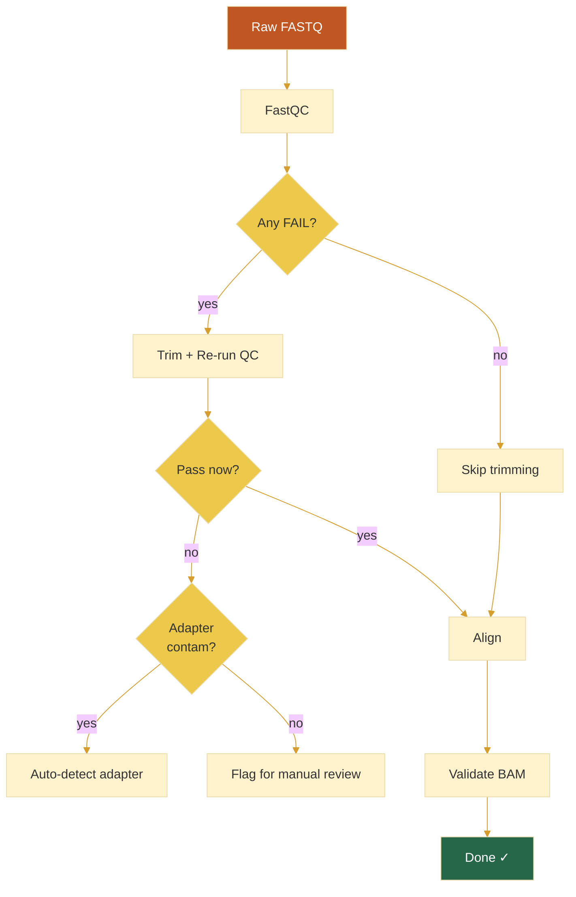

# 10 — Quality Control: FastQC, Trimming, and Filtration

**Prerequisites:** `06-sequencing-technology.md`, `07-read-lengths-coverage.md`, `08-alignment-theory.md`, `09-quality-scores.md`

**See also:** `11-fasta-fastq.md`, `14-samtools-deep-dive.md`

---

## The Big Idea

Sequencing data is noisy. Quality control identifies which reads are good, which need trimming, and which should be discarded entirely.

```
FASTQ → QC Check → Trim/Purge → Clean FASTQ → Pipeline
                      ↑
              (iterative — re-run QC after trimming)
```

---

## 1. FastQC: The First Thing You Run

FastQC is the standard QC tool for raw sequencing data:

```bash
fastqc sample_R1.fastq.gz sample_R2.fastq.gz
```

Output: an HTML report + ZIP file with summary metrics.

```
Per-Sequence Quality Scores:
  ✓ Good Library                    ✗ Bad Library
  ┌──────────────────────┐         ┌──────────────────────┐
  │      ████            │         │   ██        ██       │
  │    ████████          │         │  ████      ████      │
  │   ██████████         │         │ ██████    ██████     │
  │  ████████████        │         │ ██████    ██████     │
  │ ██████████████       │         │██████    ████████    │
  │ ██████████████       │         │██████    ████████    │
  │████████████████      │         │██████    ████████    │
  │████████████████      │         │██████    ████████    │
  │████████████████      │         │██████    ████████    │
  └──────────────────────┘         └──────────────────────┘
  Peak at Q38 (single peak)        Two peaks = contamination!

GC Content Distribution:
  ✓ Normal GC Content              ✗ Contamination
  ┌──────────────────────┐         ┌──────────────────────┐
  │        ██            │         │   ██         ██      │
  │       ████           │         │  ████       ████     │
  │       ████           │         │ ██████     ██████    │
  │      ██████          │         │ ██████     ██████    │
  │     ████████         │         │████████   ████████   │
  │    ██████████        │         │████████   ████████   │
  └──────────────────────┘         └──────────────────────┘
  Single peak ~41%                  Two peaks = different source
```

### Key FastQC Modules

| Module | What It Checks | Red Flag |
|--------|---------------|----------|
| **Per-base quality** | Mean Q-score at each cycle | Drop below Q20 toward end |
| **Per-sequence quality** | Distribution of mean read Q-scores | Peak below Q20 |
| **GC content** | %GC distribution vs theoretical | Deformed peak (contamination) |
| **N content** | Fraction of ambiguous bases | >5% N at any position |
| **Adapter content** | Known adapter sequence presence | >5% adapter anywhere |
| **Overrepresented sequences** | Very common sequences | Contamination or rRNA |
| **Sequence duplication** | PCR duplicate rate | >50% (indicates low complexity) |
| **K-mer enrichment** | Overrepresented k-mers | Biased representation |
| **Sequence length** | Distribution of read lengths | Unexpected fragmentation |

### Interpreting FastQC Output

**Per-base quality (the most important plot):**

```
Good:
  Q40 ┤▄███████████████████████████████████████████████
  Q30 ┤████████████████████████████████████████████████
  Q20 ┤████████████████████████████████████████████████
  Q10 ┤████████████████████████████████████████████████
      └─────────────────────────────────────────→
          1                  75                  150

Bad:
  Q40 ┤████████████▄▄▄▄▄▄▄▄▄▄▄▄▄
  Q30 ┤████████████████████████████████████▄▄▄▄▄▄▄
  Q20 ┤██████████████████████████████████████████████
  Q10 ┤██████████████████████████████████████████████
      └─────────────────────────────────────────→
          1                  75                  150
```

**Per-sequence GC content:**

```
Good (normal distribution):
          ▄
       ▄▄█▄▄
     ▄▄█████▄▄
   ▄▄█████████▄▄
   █████████████
     30%    50%    70%

Bad (bimodal):
      ▄                   ▄
   ▄▄▄█▄▄▄            ▄▄▄█▄▄▄
   █████████▄▄▄▄▄▄▄▄█████████
     30%    50%    70%
  (contamination — two different GC distributions)
```

---

## 2. Quality Trimming

Trimming removes low-quality bases from read ends:

```
Before trimming:
  ACTGACTGACTGACTGACTGACTGACTGACTGACTG####
              ↑ quality drops here       ↑

After trimming (at Q20 threshold):
  ACTGACTGACTGACTGACTGACTGACTGACTG
```

### Trimming Tools

```bash
# fastp — modern all-in-one QC + trimming
fastp -i sample_R1.fastq.gz -I sample_R2.fastq.gz \
      -o clean_R1.fastq.gz -O clean_R2.fastq.gz \
      --qualified_quality_phred 20 \
      --length_required 36 \
      --cut_front --cut_tail

# Trimmomatic — classic, still widely used
trimmomatic PE \
    sample_R1.fastq.gz sample_R2.fastq.gz \
    clean_R1.fastq.gz clean_unpaired_R1.fastq.gz \
    clean_R2.fastq.gz clean_unpaired_R2.fastq.gz \
    ILLUMINACLIP:adapters.fa:2:30:10 \
    LEADING:3 TRAILING:3 SLIDINGWINDOW:4:15 MINLEN:36

# cutadapt — focused on adapter removal
cutadapt -a AGATCGGAAGAGC -A AGATCGGAAGAGC \
         -o clean_R1.fastq.gz -p clean_R2.fastq.gz \
         sample_R1.fastq.gz sample_R2.fastq.gz
```

### FastQC Before vs After

```
Before trimming:   After trimming:
╔══════════════════╗  ╔══════════════════╗
║ PASS: 4          ║  ║ PASS: 10         ║
║ WARN: 4          ║  ║ WARN: 1          ║
║ FAIL: 3          ║  ║ FAIL: 0          ║
╚══════════════════╝  ╚══════════════════╝
```

Always run FastQC **before and after** trimming to verify improvement.

---

## 3. Adapter Contamination

Adapters are synthetic sequences added during library prep. If the insert is shorter than the read length, the sequencer reads into the adapter:

```
Read:  ACTGACTGACTG---AGATCGGAAGAGCACACGTCTGAACTCCAGTCAC
                       ↑↑↑↑↑↑↑↑↑↑↑↑↑↑↑↑↑↑↑↑↑↑↑↑↑↑↑↑↑↑↑↑
                       Adapter sequence (should be removed)
```

### Detection

```bash
# FastQC identifies adapters automatically (in Illumina data)
# Or check manually:
zcat sample.fastq.gz | head -10000 | grep -c "AGATCGGAAGAGC"

# fastp reports adapter detection rate
fastp -i sample.fastq.gz -j report.json
cat report.json | python3 -c "import json,sys; d=json.load(sys.stdin); print(d['adapter_cutting']['adapter_trimmed_reads'])"
```

### How Much Adapter to Expect

```
Good WGS library: <1% adapter content
Bad library (fragmented): >10% adapter content
RNA-seq: depends on fragmentation method
```

---

## 4. PCR Duplicates

During library prep, PCR amplification creates identical copies of the same original fragment.

```
Original molecules:     A   B   C   D
After PCR (15 cycles):  AAAAAAAAAA  BBBBBBBB  CCCCCCCC  DDDDDDDD
                        ↑ 10 duplicates each
```

For **WGS**, a 5–15% duplicate rate is normal. For **RNA-seq**, it can be much higher (30–50%).

High duplicates = wasted sequencing budget. You're paying for the same molecule multiple times.

### Marking Duplicates

```bash
# Using Picard (Java)
picard MarkDuplicates -I aligned.bam -O marked.bam -M metrics.txt

# Using Sambamba (faster)
sambamba markdup -t 4 aligned.bam marked.bam

# Using SAMtools (no separate dedup, but can fixmate)
samtools fixmate -m aligned.bam fixmate.bam
samtools sort fixmate.bam > sorted.bam
samtools markdup sorted.bam deduped.bam
```

The duplicate flag (0x400) is set in the SAM FLAG. Filter with:

```bash
samtools view -F 0x400 deduped.bam > deduped_and_filtered.bam
```

---

## 5. Contamination Detection

### Cross-Sample Contamination

```bash
# Check mitochondrial reads for contamination from other species
samtools idxstats aligned.bam | grep "chrM" | awk '{print $3}'

# Verify sample identity with genotype concordance
bcftools gtcheck -g known_genotypes.vcf.gz sample.vcf.gz
```

### Adapter/Index Hopping

On patterned flow cells (NovaSeq), indexes can "hop" between samples:

```bash
# FastQC overrepresented sequences can detect this
# Or check for unexpected barcode combinations in demultiplexed data
```

---

## 6. QC Reporting Tools

| Tool | What It Does |
|------|-------------|
| **MultiQC** | Aggregates FastQC + alignment + variant stats into one report |
| **fastp** | All-in-one QC + trimming with HTML report |
| **Sentieon** | Commercial, comprehensive QC metrics |
| **VerifyBamID** | Detects sample contamination in BAM files |
| **Qualimap** | BAM quality metrics (coverage, mapped reads, etc.) |

### MultiQC Example

```bash
# After running FastQC, samtools stats, etc.:
multiqc .

# Produces multiqc_report.html with all metrics in one place
```

MultiQC is essential for any pipeline — it consolidates dozens of QC outputs into a single view.

---

## 7. QC Decision Tree



---

## 8. Example: Complete QC Workflow

```bash
# Step 1: Initial QC
fastqc raw_R1.fastq.gz raw_R2.fastq.gz -o qc_raw/

# Step 2: Trim
fastp -i raw_R1.fastq.gz -I raw_R2.fastq.gz \
      -o clean_R1.fastq.gz -O clean_R2.fastq.gz \
      --detect_adapter_for_pe \
      --cut_front 5 --cut_tail \
      --qualified_quality_phred 20 --unqualified_percent_limit 40 \
      --length_required 36

# Step 3: Post-trim QC
fastqc clean_R1.fastq.gz clean_R2.fastq.gz -o qc_clean/

# Step 4: Alignment
bwa mem -t 8 hg38.fa clean_R1.fastq.gz clean_R2.fastq.gz | \
    samtools sort -@ 4 -o aligned.bam

# Step 5: Mark duplicates
picard MarkDuplicates -I aligned.bam -O marked.bam -M markdup_metrics.txt

# Step 6: Post-alignment QC
samtools stats marked.bam > alignment_stats.txt

# Step 7: Aggregate with MultiQC
multiqc . -o final_qc/
```

---

## Exercises

1. Run FastQC on a test FASTQ file. Identify which modules pass/warn/fail.
2. If FastQC shows adapter content at 8% in R2 but 1% in R1, what might be happening?
3. Write a bash pipeline that runs FastQC on a FASTQ file, then extracts key metrics (total sequences, %GC, Q20/Q30 pass rates) from the HTML/text output using grep or awk.
4. You see a GC content plot with two peaks at 35% and 65%. What's the likely explanation? What would you do next?
5. Research: What is **optical duplication** on patterned flow cells? How does it differ from PCR duplication?

---

## Key Terms

| Term | Definition |
|------|------------|
| FastQC | Quality control tool for raw sequencing data |
| Trimming | Removing low-quality bases or adapters |
| Adapter | Synthetic sequence ligated to DNA during library prep |
| PCR duplicate | Two reads from the same original molecule (PCR artifact) |
| Optical duplicate | Two reads from the same cluster (imaging artifact) |
| MultiQC | Aggregation tool for multiple QC reports |
| Contamination | Presence of DNA from other samples or species |
| GC bias | Over/under-representation of high- or low-GC regions |

---

## Next Steps

→ `11-fasta-fastq.md` — FASTA and FASTQ file format specification  
→ `12-sam-bam-cram.md` — SAM/BAM/CRAM aligned read formats  
→ `13-vcf-bcf.md` — VCF variant format  

---

*"Don't trust data that hasn't passed QC. Garbage in, variants out."*
