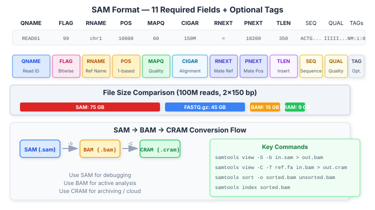
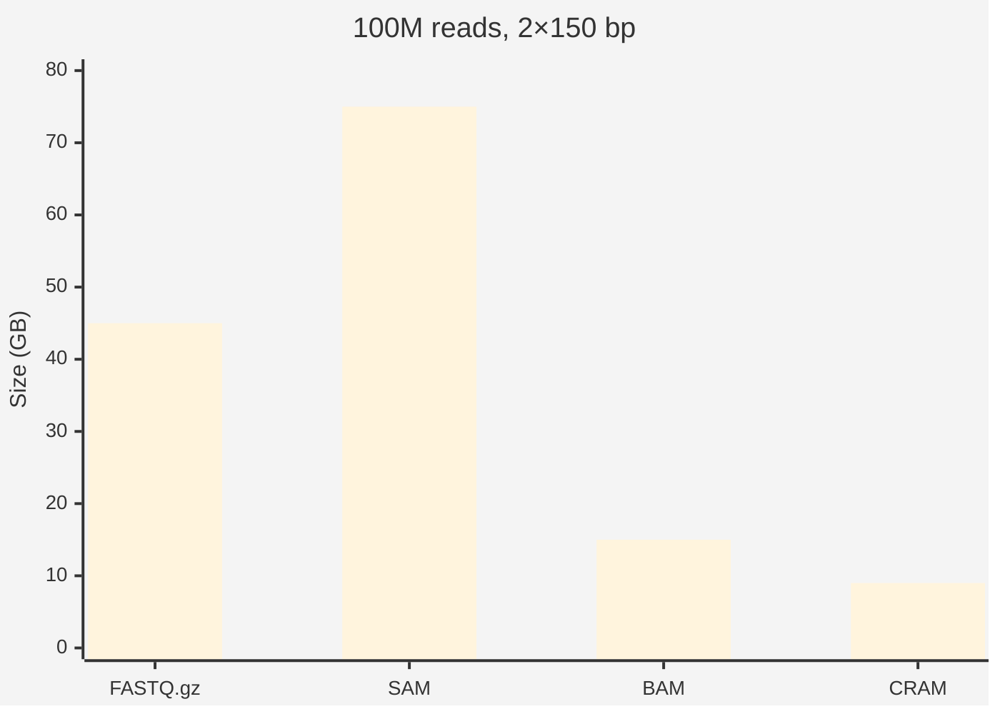

# 12 — SAM, BAM & CRAM: Aligned Read Formats

**Prerequisites:** `08-alignment-theory.md`, `11-fasta-fastq.md`

**See also:** `13-vcf-bcf.md`, `14-samtools-deep-dive.md`

---

## The Big Idea

**SAM** = human-readable text. **BAM** = compressed binary. **CRAM** = reference-compressed (smallest).

```
SAM  ~ 10× size of FASTQ (not used for storage)
BAM  ~ 3–5× smaller than FASTQ (standard format)
CRAM ~ 20–40% smaller than BAM (cloud storage)
```

**Analogy:** SAM is debug logs, BAM is a SQLite database, CRAM is a compressed Parquet.

---



## 1. SAM Format: The Specification

### Header Section (starts with @)

```
@HD VN:1.6  SO:coordinate   (header, sorted by coordinate)
@SQ SN:chr1 LN:248956422    (sequence dictionary)
@SQ SN:chr2 LN:242193529
@RG ID:sample1 SM:Sample1   (read group)
@PG ID:bwa PN:bwa           (program record)
```

### Alignment Section (11 required fields + optional tags)

```
Col  Field   Type    Description
───  ─────   ────    ───────────
1    QNAME   String  Read pair name
2    FLAG    Int     Bitwise flags
3    RNAME   String  Reference sequence name
4    POS     Int     1-based leftmost position
5    MAPQ    Int     Mapping quality
6    CIGAR   String  Alignment description
7    RNEXT   String  Mate reference name
8    PNEXT   Int     Mate position
9    TLEN    Int     Template length (insert size)
10   SEQ     String  Read sequence
11   QUAL    String  Quality scores (Phred+33)
```

### Example SAM Lines

```
# Paired-end, both mapped properly
READ01 99  chr1  10000  60  150M  =  10200  350  ACTGA...  IIIII...  NM:i:0  RG:Z:sample1

# Mate unmapped
READ02 77  chr1  15000  0  150M  *  0  0  ACTGA...  IIIII...  NM:i:3  RG:Z:sample1
```

**Columns explained:**

```
READ01   - read name
99       - FLAG (paired + proper-pair + mate-reverse + read1)
chr1     - chromosome (reference)
10000    - leftmost alignment position
60       - MAPQ (very high confidence)
150M     - CIGAR (150 bases, all matches/substitutions)
=        - mate on same chromosome
10200    - mate position
350      - insert size
ACTGA... - sequence
IIIII... - quality
NM:i:0   - tag: 0 mismatches
RG:Z:sample1 - tag: read group
```

### SAM FLAG Reference

```python
FLAG_BITS = {
    1: "read paired",
    2: "read mapped in proper pair",
    4: "read unmapped",
    8: "mate unmapped",
    16: "read reverse strand",
    32: "mate reverse strand",
    64: "first in pair",
    128: "second in pair",
    256: "not primary alignment",
    512: "fails quality check",
    1024: "PCR or optical duplicate",
    2048: "supplementary alignment",
}

def flag_to_list(flag: int) -> list[str]:
    return [desc for bit, desc in FLAG_BITS.items() if flag & bit]
```

Common FLAGs to remember:

| FLAG | Binary | Meaning |
|------|--------|---------|
| 4 | 100 | Unmapped |
| 16 | 10000 | Reverse strand |
| 99 | 1100011 | Paired, proper, mate-rev, R1 |
| 147 | 10010011 | Paired, proper, rev, mate-fwd, R2 |
| 1024 | 10000000000 | Duplicate |

---

## 2. BAM: The Binary Format

BAM is the **compressed, indexable** version of SAM.

### Structure

```
BAM file:
  [Magic "BAM\1"] [Header] [References] [Alignments...] [BAI index]

Each alignment is binary-encoded for compactness:
  - Fixed-width fields (FLAG, POS, MAPQ, TLEN)
  - Variable-width fields (CIGAR, SEQ, QUAL, tags)
  - Block compression (BGZF) for random access
```

### Size Comparison



```
FASTQ.gz:  ~45 GB
SAM:       ~75 GB  (never store)
BAM:       ~15 GB  (with compression)
CRAM:      ~9 GB   (with reference)
```

### BAM Index (.bai)

The .bai index enables fast region queries:

```bash
# Without index: scan entire BAM (slow)
samtools view full.bam chr1:10000-20000  # fast with .bai

# Without index: must scan all reads
samtools view full.bam chr1:10000-20000  # very slow without .bai

# Create index
samtools index aligned.bam
samtools index -c aligned.bam  # CSI index (for >512 Mb genomes)
```

---

## 3. CRAM: Reference-Based Compression

CRAM achieves better compression by using the **reference sequence** to store only differences:

```
CRAM compression method:
  Instead of:
    SEQ = ACTGACTGACTG (full sequence)
  
  Store:
    Bases that differ from reference + positions
    (Much less data when alignment is close to reference)
```

### Size Comparison for 30× Human WGS

```
Format    Size    Ratio vs BAM
─────     ────    ─────────────
FASTQ.gz  250 GB  —
BAM       90 GB   1.0×
CRAM      35 GB   0.39×
CRAM (lossy) 25 GB   0.28×
```

### CRAM Lossy Mode

CRAM can discard bases that exactly match the reference:

```bash
# Lossless CRAM
samtools view -C -T reference.fa aligned.bam > aligned.cram

# Lossy (discard bases matching reference, keep mismatches)
samtools view -C -T reference.fa --output-fmt-option lossy_names=QUALITY_SORTED aligned.bam > aligned.cram
```

**Trade-off:** Lossless CRAM retains all data. Lossy CRAM can't recover bases that perfectly match the reference.

---

## 4. Converting Between Formats

```bash
# SAM → BAM
samtools view -S -b input.sam > output.bam

# BAM → SAM (viewable)
samtools view -h input.bam > output.sam

# BAM → CRAM (requires reference)
samtools view -C -T reference.fa input.bam > output.cram

# CRAM → BAM
samtools view -b -T reference.fa input.cram > output.bam

# Sorting
samtools sort -o sorted.bam unsorted.bam

# Indexing
samtools index sorted.bam
```

---

## 5. Key Operations

### Region Query (Requires Index)

```bash
# Extract reads overlapping a region
samtools view aligned.bam chr1:1000000-1000100

# Count reads in region
samtools view -c aligned.bam chr1:1000000-1000100

# Extract reads for specific gene (using BED file)
samtools view -L genes.bed aligned.bam
```

### Flag Filtering

```bash
# Only properly paired reads
samtools view -f 2 aligned.bam

# Remove duplicates
samtools view -F 1024 aligned.bam

# Only mapped reads
samtools view -F 4 aligned.bam

# Only first-in-pair reads
samtools view -f 64 aligned.bam

# Complex: proper paired AND not duplicate AND mapped
samtools view -f 2 -F 1028 aligned.bam  # 1028 = 4+1024
```

### Statistics

```bash
# Quick stats
samtools flagstat aligned.bam

# Detailed stats
samtools stats aligned.bam > stats.txt

# Coverage per position
samtools depth aligned.bam

# Coverage per region
samtools bedcov targets.bed aligned.bam
```

---

## 6. SAM/BAM in Code (Python)

```python
import pysam

# Open BAM (requires .bai index)
bam = pysam.AlignmentFile("aligned.bam", "rb")

# Iterate all reads
for read in bam:
    print(read.query_name, read.reference_name, read.pos, read.mapq)

# Region query
for read in bam.fetch("chr1", 1000000, 1000100):
    pass

# Access key fields
read.query_name    # QNAME
read.flag          # FLAG
read.reference_name  # RNAME
read.reference_start  # POS (0-based)
read.mapping_quality  # MAPQ
read.cigarstring   # CIGAR string
read.query_sequence  # SEQ
read.query_qualities  # QUAL (list of int)

# Check flags
read.is_paired        # 0x1
read.is_proper_pair   # 0x2
read.is_unmapped      # 0x4
read.is_read1         # 0x40
read.is_duplicate     # 0x400

bam.close()
```

---

## 7. SAM/BAM in Code (C# — Portfolio Project)

```csharp
// This is intentionally simplified — full BAM parsing requires
// BGZF decompression + binary spec. Use a library in production
// (e.g., LibHtslib.Net or invoke samtools via CLI).

// Reading SAM output from samtools
var proc = Process.Start(new ProcessStartInfo
{
    FileName = "samtools",
    Arguments = "view -h aligned.bam chr1:10000-20000",
    RedirectStandardOutput = true,
    UseShellExecute = false,
});

using var reader = new StreamReader(proc!.StandardOutput);

// Skip header
while (!reader.EndOfStream)
{
    var line = reader.ReadLine()!;
    if (!line.StartsWith('@')) // header lines
    {
        var fields = line.Split('\t');
        var qname = fields[0];
        var flag = int.Parse(fields[1]);
        var pos = int.Parse(fields[3]);
        var mapq = int.Parse(fields[4]);
        var cigar = fields[5];
        var seq = fields[9];
        // Process...
    }
}
```

---

## 8. File Validation

```bash
# Check BAM integrity
samtools quickcheck aligned.bam && echo "OK" || echo "CORRUPT"

# Count reads (fast)
samtools view -c aligned.bam

# Verify header matches reference
samtools view -H aligned.bam | grep @SQ

# Compare R1 vs R2 counts
samtools view -c -f 64 aligned.bam   # R1 count
samtools view -c -f 128 aligned.bam  # R2 count
```

---

## Exercises

1. Given a SAM file with FLAG = 83, what does this mean? (Break down the binary.)
2. Write a Python script using `pysam` that reads a BAM file and reports: total reads, mapped reads, properly paired reads, and PCR duplicate rate.
3. Convert a BAM to CRAM with and without lossy compression. Compare file sizes. Can you recover the original sequence from the lossy CRAM?
4. Why does CRAM need the reference FASTA file to decompress, while BAM does not?
5. For a 30× human WGS BAM, approximately how many lines are in the SAM file if converted? Estimate the storage needed.

---

## Key Terms

| Term | Definition |
|------|------------|
| SAM | Sequence Alignment/Map — text format for aligned reads |
| BAM | Binary compressed version of SAM (standard format) |
| CRAM | Reference-compressed alignment format (smallest) |
| BAI | BAM index file for random access |
| CSI | Coordinate-sorted index (supports larger references) |
| FLAG | Bitwise field encoding read/alignment properties |
| MAPQ | Mapping quality (Phred-scale) |
| CIGAR | Compact encoding of alignment operations |
| BGZF | Block gzip compression (used by BAM) |

---

## Next Steps

→ `13-vcf-bcf.md` — The VCF variant format  
→ `14-samtools-deep-dive.md` — SAMtools command reference  
→ `15-bcftools-deep-dive.md` — BCFtools command reference  

---

*"BAM is the ZIP file of genomics — ubiquitous, compressed, and indexed."*
