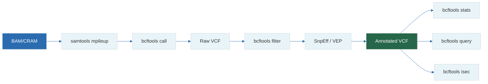

# 13 — VCF & BCF: Variant Call Format

**Prerequisites:** `05-mutations-genetics.md`, `08-alignment-theory.md`, `12-sam-bam-cram.md`

**See also:** `15-bcftools-deep-dive.md`, `14-samtools-deep-dive.md`

---

## The Big Idea

A **VCF** (Variant Call Format) file lists every position where the sample's DNA differs from the reference genome.

```
Reference:  ...ATGCGTAG...
Sample:     ...ATGCATAG...
                      ↑
VCF:  chr1  12345  .  G  A  ...  (reference=G, sample=A)
```

**Analogy:** VCF is a `git diff` of the genome. Each row is one hunk.

---

```
##fileformat=VCFv4.2
##INFO=<ID=DP,Number=1,Type=Integer,Description="Total Depth">
##FORMAT=<ID=GT,Number=1,Type=String,Description="Genotype">
#CHROM  POS    ID  REF  ALT  QUAL  FILTER  INFO  FORMAT  SAMPLE
chr1    10000  .   G    A    100   PASS    DP=50 GT:GQ   0/1:40
```

| Column   | Description                        |
|----------|------------------------------------|
| CHROM    | Chromosome name                    |
| POS      | Position (1-based)                 |
| ID       | dbSNP rsID or `.`                  |
| REF/ALT  | Reference and alternate alleles    |
| QUAL     | Phred-scaled quality score         |
| FILTER   | PASS or filter reason              |
| INFO     | Semi-colon separated metadata      |
| FORMAT   | Genotype field format              |
| SAMPLE   | Sample genotype data               |

**Genotype (GT) codes:**
`0/0` = Hom-Ref, `0/1` = Heterozygous, `1/1` = Hom-Alt, `./.` = No call



## 1. VCF File Structure

A VCF file has two parts: **header** (meta-information) and **records** (variants).

### Header Lines

```
##fileformat=VCFv4.2
##fileDate=20240101
##source=bcftools1.19
##reference=GRCh38
##contig=<ID=chr1,length=248956422>
##INFO=<ID=DP,Number=1,Type=Integer,Description="Total Depth">
##INFO=<ID=AF,Number=A,Type=Float,Description="Allele Frequency">
##FORMAT=<ID=GT,Number=1,Type=String,Description="Genotype">
##FORMAT=<ID=GQ,Number=1,Type=Integer,Description="Genotype Quality">
##FORMAT=<ID=PL,Number=G,Type=Integer,Description="Phred-scaled Genotype Likelihoods">
#CHROM  POS     ID      REF     ALT     QUAL    FILTER  INFO    FORMAT  SAMPLE1
```

### Required Columns

```
#CHROM  POS     ID      REF     ALT     QUAL    FILTER  INFO    FORMAT  SAMPLES
chr1    10000   .       G       A       100     PASS    DP=50   GT:GQ   0/1:40
chr1    20000   rs12345 T       C       500     PASS    DP=120  GT:GQ   1/1:99
chr1    30000   .       AG      A       50      LowQual DP=30   GT:GQ   0/1:30
```

| Column | Description | Example |
|--------|-------------|---------|
| CHROM | Chromosome | chr1 |
| POS | 1-based position | 10000 |
| ID | dbSNP rsID or `.` | rs12345 |
| REF | Reference base(s) | G |
| ALT | Alternate base(s) | A |
| QUAL | Phred-scaled quality | 100 |
| FILTER | Filter status | PASS, LowQual, `.` |
| INFO | Variant-level info | DP=50;AF=0.25 |
| FORMAT | Genotype field format | GT:GQ:DP |
| SAMPLE | Genotype values per sample | 0/1:40:50 |

---

## 2. Genotype Encoding

### GT — Genotype

```
0/0 = homozygous reference
0/1 = heterozygous
1/1 = homozygous alternate
1/2 = heterozygous for two different alternate alleles
./. = no call
0|1 = phased (paternal=0, maternal=1)
```

### GQ — Genotype Quality

Phred-scaled probability that the genotype is wrong:

```
GQ=40 → P(genotype wrong) = 0.0001
```

### PL — Phred-scaled Genotype Likelihoods

Three values: P(hom-ref), P(het), P(hom-alt)

```
PL: 0,40,255

0     = most likely genotype (0/0)
40    = -10 × log₁₀(P(heterozygous))
255   = maximum (-10 × log₁₀(P(homozygous alt)))

Lower PL = more likely for that genotype
```

```python
def pl_to_probabilities(pl: list[int]) -> list[float]:
    """Convert PL values to genotype probabilities."""
    import math
    probs = [10 ** (-p / 10) for p in pl]
    total = sum(probs)
    return [p / total for p in probs]

pl = [0, 40, 255]
prob = pl_to_probabilities(pl)
# P(0/0) ≈ 0.9999, P(0/1) ≈ 0.0001, P(1/1) ≈ 0.0000
```

---

## 3. INFO Fields (per-variant)

Common INFO fields:

| Field | Type | Description |
|-------|------|-------------|
| DP | Integer | Total depth at this position |
| AF | Float | Allele frequency (in population) |
| AN | Integer | Total number of alleles in samples |
| AC | Integer | Alternate allele count |
| NS | Integer | Number of samples with data |
| DB | Flag | Entry in dbSNP |
| MLEAF | Float | Maximum likelihood estimate of AF |

```bash
# Extract DP and AF from all variants
bcftools query -f '%CHROM\t%POS\t%DP\t%AF\n' variants.vcf.gz | head
```

---

## 4. FORMAT Fields (per-sample per-variant)

| Field | Type | Description |
|-------|------|-------------|
| GT | String | Genotype (e.g., 0/1) |
| GQ | Integer | Genotype quality |
| DP | Integer | Read depth at this position |
| AD | List | Allele depth (ref, alt) |
| PL | List | Phred-likelihoods |
| VAF | Float | Variant allele frequency (calculated: AD_alt / DP) |

### AD — Allele Depth

```
AD: 30,20

30 reads supporting reference
20 reads supporting alternate
VAF = 20 / (30 + 20) = 0.40
```

```python
def vaf_from_ad(ad: list[int]) -> float:
    """Calculate VAF from allele depth."""
    if sum(ad) == 0:
        return 0.0
    return ad[1] / sum(ad)
```

---

## 5. VCF Filtering

### FILTER Column

```
PASS           - passed all filters
LowQual        - below quality threshold
SnpCluster     - multiple SNVs in short window
HighDepth      - excessive depth (possible artifact)
LowDepth       - insufficient depth
```
### Filtering Variants

```bash
# Basic quality filter (keep Q30+)
bcftools filter -i 'QUAL > 30' input.vcf.gz -o high_qual.vcf.gz

# Filter by depth (keep 10x-100x)
bcftools filter -i 'INFO/DP >= 10 && INFO/DP <= 100' input.vcf.gz

# Filter by allele frequency (rare variants only)
bcftools filter -i 'INFO/AF < 0.01 || INFO/AF = "."' input.vcf.gz

# Filter by genotype quality
bcftools filter -i 'FMT/GQ > 20' input.vcf.gz

# Keep only PASS variants
bcftools view -f PASS input.vcf.gz

# Remove variants that fail any filter
bcftools view -f .,PASS input.vcf.gz
```

### Complex Filtering with Expressions

```bash
# Missense (non-synonymous) variants only
bcftools filter -i 'INFO/ANN ~ "missense"' input.vcf.gz

# Heterozygous variants only
bcftools filter -i 'FMT/GT = "0/1"' input.vcf.gz

# High-confidence rare missense
bcftools filter -i \
  'QUAL > 30 && INFO/DP >= 20 && (INFO/AF < 0.01 || INFO/AF = ".") && FMT/GT = "0/1"' \
  input.vcf.gz
```

---

## 6. Annotation

Raw VCF files just have positions and alleles. **Annotation** adds biological context:

### Using SnpEff / VEP

```bash
# SnpEff annotation
snpEff GRCh38.99 input.vcf.gz > annotated.vcf.gz

# Annovar (table-based)
table_annovar.pl input.vcf humandb/ -buildver hg38 -out output

# VEP (Ensembl)
vep -i input.vcf.gz -o output.vcf.gz --cache
```

### After annotation, INFO contains:

```
ANN=A|missense_variant|MODERATE|TP53|ENSG00000141510|...
     ↑   ↑                ↑        ↑
   Allele Effect         Severity  Gene
```

---

## 7. Multi-Sample VCF

VCF can store many samples in one file:

```
#CHROM  POS     REF  ALT  QUAL  FILTER  INFO  FORMAT    SAMPLE1  SAMPLE2  SAMPLE3
chr1    10000   G    A    100   PASS    DP=50 GT:GQ     0/1:40   0/0:50   1/1:99
chr1    20000   T    C    500   PASS    DP=120 GT:GQ    1/1:99   0/1:45   0/0:60
```

```bash
# Extract genotypes for specific sample
bcftools query -s SAMPLE1 -f '%CHROM\t%POS\t[%GT]\n' multi.vcf.gz

# Count variants per sample
bcftools stats -s - multi.vcf.gz | grep "number of records"
```

---

## 8. BCF — Binary VCF

BCF is the **binary** version of VCF (like BAM is to SAM):

```bash
# VCF → BCF (smaller, faster)
bcftools view -O b input.vcf.gz > output.bcf

# BCF → VCF
bcftools view input.bcf > output.vcf

# Working with BCF is identical:
bcftools filter -i 'QUAL > 30' input.bcf > filtered.bcf
```

BCF is typically 2–3× smaller than compressed VCF and faster to process.

---

## 9. VCF Statistics

```bash
# Comprehensive stats
bcftools stats input.vcf.gz > stats.txt

# Transition/Transversion ratio
grep "TSTV" stats.txt

# Number of SNVs, indels
grep "number of SNPs" stats.txt
grep "number of indels" stats.txt

# Allele frequency spectrum
bcftools query -f '%AF\n' input.vcf.gz | sort -n | uniq -c

# Genotype concordance
bcftools gtcheck -g truth.vcf.gz input.vcf.gz
```

### Ti/Tv Ratio

```
Whole genome sequencing:  2.0–2.2
Whole exome sequencing:   2.8–3.2
Targeted panel:           2.5–3.5

Deviations suggest:
  < 1.5:  Possible contamination or sequencing error bias
  > 3.5:  Possible PCR bias (excessive transitions)
```

---

## 10. VCF in Code (Python)

```python
import pysam

vcf = pysam.VariantFile("variants.vcf.gz", "r")

# Iterate all variants
for rec in vcf:
    chrom = rec.chrom
    pos = rec.pos
    ref = rec.ref
    alts = rec.alts
    qual = rec.qual
    dp = rec.info.get("DP", None)

    # Per-sample genotype
    for sample in vcf.header.samples:
        gt = rec.samples[sample]["GT"]
        gq = rec.samples[sample]["GQ"]
        ad = rec.samples[sample].get("AD", [0, 0])
        print(f"{chrom}:{pos} {ref}→{alts} [{sample}] GT={gt} GQ={gq}")

vcf.close()
```

---

## Exercises

1. Write a Python script that reads a VCF file and reports: total variants, SNVs, indels, and Ti/Tv ratio.
2. Given a VCF with 100 samples, find all variants where exactly one sample has a non-reference genotype.
3. Filter a VCF to keep only high-quality (QUAL > 30) missense variants with population AF < 1%.
4. Calculate the Ti/Tv ratio from a VCF. If it's 1.2, what might this indicate about the data?
5. What is the difference between **hard filtering** and **soft filtering** in VCF files? When would you use each approach? How do FILTER flags like `PASS` vs `LowQual` affect downstream analysis?

---

## Key Terms

| Term | Definition |
|------|------------|
| VCF | Variant Call Format — tabular variant storage |
| BCF | Binary VCF (compressed, indexed) |
| GT | Genotype (0/0, 0/1, 1/1) |
| GQ | Genotype quality (Phred-scaled) |
| PL | Genotype likelihoods (Phred-scaled) |
| AD | Allele depth (reads supporting each allele) |
| DP | Total depth at position |
| VAF | Variant allele frequency |
| ANN | Annotation field (gene, effect, impact) |
| Ti/Tv | Transition/Transversion ratio |
| FILTER | PASS, LowQual, or custom filter labels |
| rsID | dbSNP reference SNP identifier |

---

## Next Steps

→ `14-samtools-deep-dive.md` — SAMtools commands for BAM processing  
→ `15-bcftools-deep-dive.md` — BCFtools commands for VCF processing  
→ `16-nextflow-dsl2.md` — Automating the full pipeline  

---

*"A VCF file is a diff against the human reference. Interpret it the same way you'd read a code review."*
