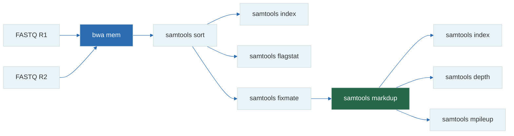

# 14 — SAMtools Deep Dive

**Prerequisites:** `12-sam-bam-cram.md`, `08-alignment-theory.md`

**See also:** `13-vcf-bcf.md`, `15-bcftools-deep-dive.md`

---

## The Big Idea

**SAMtools** is the Swiss Army knife for BAM/CRAM manipulation. If you learn 10 commands well, you can answer almost any question about aligned sequencing data.

---

## 1. Essential Commands Summary

```
samtools view      — Convert/query/view alignments
samtools sort      — Sort alignments by coordinate
samtools index     — Create BAM/CRAM index
samtools flagstat  — Quick alignment statistics
samtools stats     — Detailed alignment statistics
samtools depth     — Per-base coverage
samtools mpileup   — Generate VCF/BCF from BAM
samtools faidx     — Index/extract reference FASTA
samtools fixmate   — Fix mate-pair information
samtools markdup   — Mark/remove PCR duplicates
samtools merge     — Merge multiple BAM files
samtools cat       — Concatenate BAM files
samtools addreplacerg — Add/replace read groups
samtools fastq     — Convert BAM back to FASTQ
samtools collate   — Shuffle reads (for duplicate marking)
samtools calmd     — Calculate MD tags
samtools tview     — Interactive text-based viewer
samtools head      — View first alignments
```

---

## 2. `samtools view` — The Most Important Command

```bash
# Basic usage
samtools view aligned.bam                                    # Full file (no header)
samtools view -h aligned.bam                                 # With header
samtools view -b aligned.bam > copy.bam                      # Output BAM
samtools view -h -o output.sam aligned.bam                   # Output SAM

# Region query (requires .bai index)
samtools view aligned.bam chr1:10000-20000

# Filter by FLAG
samtools view -f 2 aligned.bam          # Keep proper pairs only
samtools view -F 4 aligned.bam          # Remove unmapped
samtools view -F 1024 aligned.bam       # Remove duplicates
samtools view -f 2 -F 1028 aligned.bam  # Proper pair, not unmapped, not dup

# Filter by MAPQ
samtools view -q 30 aligned.bam         # MAPQ >= 30

# Filter by quality (per-base mean)
samtools view -Q 30 aligned.bam         # Mean Q-score >= 30

# Count reads
samtools view -c aligned.bam            # Total reads
samtools view -c -f 2 aligned.bam       # Proper pairs
samtools view -c -F 4 aligned.bam       # Mapped reads

# Subset by region file
samtools view -L targets.bed aligned.bam  # Only regions in BED file

# Output specific fields
samtools view -f 2 aligned.bam | cut -f 1,3,4,5,9 | head
```

---

## 3. `samtools sort` — Always Sort Before Indexing

```bash
# Default (by coordinate)
samtools sort -o sorted.bam unsorted.bam

# By read name (needed for fixmate)
samtools sort -n -o by_name.bam unsorted.bam

# With threads
samtools sort -@ 8 -o sorted.bam unsorted.bam

# Memory limit
samtools sort -m 4G -o sorted.bam unsorted.bam

# Sort and index in one step
samtools sort unsorted.bam > sorted.bam
samtools index sorted.bam
```

---

## 4. `samtools flagstat` — First QC After Alignment

```bash
samtools flagstat aligned.bam
```

Example output:

```
1000000 + 0 in total (QC-passed reads + QC-failed reads)
980000 + 0 primary
960000 + 0 mapped (96.00% : N/A)
940000 + 0 properly paired (95.92% : N/A)
950000 + 0 with mate mapped to a different chr
10000 + 0 with mate mapped to a different chr (mapQ>=5)
50000 + 0 secondary
40000 + 0 supplementary
20000 + 0 duplicates
0 + 0 paired in sequencing
500000 + 0 read1
500000 + 0 read2
0 + 0 properly paired (0.00% : N/A)
```

**Key metrics to check:**

```
Mapped %:         > 95% for WGS
Properly paired:  > 90% for good library
Duplicates:       < 15% for WGS
```

---

## 5. `samtools stats` — Detailed Statistics

```bash
samtools stats aligned.bam > stats.txt

# Key sections:
grep "^SN" stats.txt    # Summary numbers
grep "^IS" stats.txt    # Insert size distribution
grep "^COV" stats.txt   # Coverage distribution
grep "^GCD" stats.txt   # GC depth distribution
```

### Parsing stats output

```bash
# Extract mean insert size
grep "insert size average" stats.txt

# Extract mean coverage
grep "average length" stats.txt

# Extract Pct of reads mapped
grep "reads mapped:" stats.txt
```

---

## 6. `samtools depth` — Coverage Analysis

```bash
# Per-base depth for entire genome (HUGE output)
samtools depth aligned.bam

# Region-specific
samtools depth -r chr1:10000-20000 aligned.bam

# Output to file
samtools depth -o depths.txt -r chr1:10000-20000 aligned.bam

# Mean coverage
samtools depth aligned.bam | awk '{sum+=$3; n++} END {print sum/n}'

# Coverage histogram
samtools depth aligned.bam | cut -f3 | sort -n | uniq -c | sort -k2 -n | head -20

# Coverage at specific positions
samtools depth -b important_positions.bed aligned.bam
```

---

## 7. `samtools mpileup` — Variant Calling

```bash
# Simple pileup (text output)
samtools mpileup -f reference.fa aligned.bam | head

# Generate BCF (for bcftools)
samtools mpileup -uf reference.fa aligned.bam > raw.bcf

# Generate VCF directly
samtools mpileup -uvf reference.fa aligned.bam > raw.vcf
```

---

## 8. `samtools fixmate` — Preparing for Duplicate Marking

`fixmate` ensures mate-pair fields are correct:

```bash
# Step 1: Sort by read name
samtools sort -n aligned.bam > by_name.bam

# Step 2: Fix mate information
samtools fixmate -m by_name.bam fixed.bam

# -m adds MC (mate CIGAR) and MQ (mate quality) tags
# These are required for markdup

# Step 3: Sort by coordinate
samtools sort fixed.bam > sorted_fixed.bam
```

---

## 9. `samtools markdup` — Mark and Remove Duplicates

```bash
# Must run fixmate first (see above)

# Mark duplicates (don't remove)
samtools markdup sorted_fixed.bam marked.bam

# Mark and remove
samtools markdup -r sorted_fixed.bam deduped.bam
```

---

## 10. `samtools merge` and `samtools cat`

```bash
# Merge multiple sorted BAMs (re-sorts output)
samtools merge merged.bam sample1.bam sample2.bam sample3.bam

# Cat — concatenate with same header (no re-sort)
samtools cat -o combined.bam lane1.bam lane2.bam

# Merge with region restriction
samtools merge -r chr1 merged.bam sample1.bam sample2.bam
```

---

## 11. `samtools fastq` — BAM to FASTQ

```bash
# Single-end
samtools fastq aligned.bam > reads.fastq

# Paired-end (split by read pair)
samtools fastq -1 R1.fastq -2 R2.fastq -0 unpaired.fastq -s singletons.fastq aligned.bam

# Single file interleaved
samtools fastq -N aligned.bam > interleaved.fastq
```

---

## 12. `samtools calmd` — MD Tag Calculation

The **MD tag** encodes mismatches compactly:

```bash
samtools calmd -b aligned.bam reference.fa > with_md.bam

# Now each read has MD:Z tag:
# MD:Z:10A5T0
#   Match 10 bases → A mismatch → match 5 → T mismatch → end
```

---

## 13. `samtools tview` — Text-Based Viewer

```bash
# Interactive viewer (q to quit)
samtools tview aligned.bam reference.fa

# Jump to a specific region
samtools tview aligned.bam reference.fa -p chr1:10000

# Key bindings:
#   g       — go to position
#   .       — toggle dot view (show matches as dots)
#   space   — scroll right
#   b       — scroll left
#   q       — quit
```

---

## 14. Piping and Chaining

SAMtools is designed for Unix pipes:

```bash
# Align → sort → index in one pipeline
bwa mem -t 8 reference.fa R1.fastq.gz R2.fastq.gz | \
    samtools sort -@ 4 -T /tmp/bwa -o aligned.bam
samtools index aligned.bam

# View specific region with filters
samtools view -f 2 -F 1024 -q 30 aligned.bam chr1:10000-20000

# Coverage track for IGV
samtools depth -a aligned.bam | gzip > coverage.bedgraph.gz

# Count mismatches
samtools view aligned.bam | awk '{print $1, $6}' | grep "M" | wc -l
```

---

## 15. Common Workflows

### Full Alignment Pipeline



```bash
REF=hg38.fa
SAMPLE=sample

# Align
bwa mem -t 8 $REF ${SAMPLE}_R1.fastq.gz ${SAMPLE}_R2.fastq.gz | \
    samtools sort -@ 4 -o ${SAMPLE}.bam

# Index
samtools index ${SAMPLE}.bam

# QC
samtools flagstat ${SAMPLE}.bam > ${SAMPLE}.flagstat

# Fixmate + dedup
samtools sort -n ${SAMPLE}.bam | \
    samtools fixmate -m - ${SAMPLE}_fixmate.bam
samtools sort ${SAMPLE}_fixmate.bam | \
    samtools markdup - ${SAMPLE}_dedup.bam
samtools index ${SAMPLE}_dedup.bam

# Stats
samtools stats ${SAMPLE}_dedup.bam > ${SAMPLE}.stats
```

### Calling Variants

```bash
samtools mpileup -uf reference.fa aligned.bam | \
    bcftools call -mv -o variants.vcf
```

---

## Exercises

1. Run `samtools flagstat` on a BAM file and identify any issues.
2. Count the number of properly paired reads with MAPQ ≥ 30 that are not duplicates.
3. Write a one-liner to compute the mean insert size from a BAM file.
4. Extract all reads mapping to chr1 between 10,000 and 20,000, requiring MAPQ ≥ 30, proper pairing, and not duplicate. Save as BAM.
5. Use `samtools tview` to visually inspect reads at a specific genomic position. Can you spot a heterozygous variant visually?

---

## Key Terms

| Term | Definition |
|------|------------|
| SAMtools | Toolkit for SAM/BAM/CRAM file manipulation |
| mpileup | Per-position pileup of aligned reads |
| flagstat | Quick alignment statistics |
| fixmate | Repair mate-pair information |
| markdup | Mark or remove PCR/optical duplicates |
| tview | Interactive text-based alignment viewer |
| calmd | Add MD mismatch tag to BAM |
| faidx | FASTA sequence extraction by region |

---

## Next Steps

→ `15-bcftools-deep-dive.md` — BCFtools for VCF/BCF files  
→ `16-nextflow-dsl2.md` — Automating these steps in pipelines  

---

*"If you only master one tool in genomics, make it SAMtools. Everything flows through BAM."*
