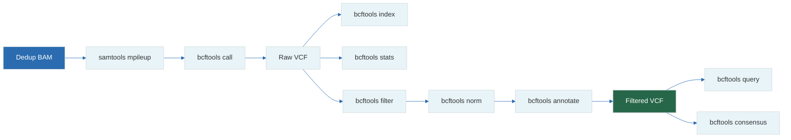

# 15 — BCFtools Deep Dive

**Prerequisites:** `13-vcf-bcf.md`, `14-samtools-deep-dive.md`

**See also:** `16-nextflow-dsl2.md`, `19-pipeline-integration.md`

---

## The Big Idea

**BCFtools** is the SAMtools counterpart for VCF/BCF files. Where SAMtools processes aligned reads (BAM), BCFtools processes variant calls (VCF/BCF).

```
SAMtools  →  BAM manipulation (raw reads)
BCFtools  →  VCF manipulation (called variants)
```

---

## 1. Essential Commands Summary

```
bcftools view     — Convert, query, filter VCF/BCF
bcftools sort     — Sort VCF/BCF by coordinate
bcftools filter   — Filter variants by expressions
bcftools query    — Extract fields (fast, no header)
bcftools stats    — Variant statistics
bcftools isec     — Intersection/comparison of VCFs
bcftools merge    — Merge multiple VCFs
bcftools norm     — Normalize variant representation
bcftools annotate — Add/remove annotations
bcftools call     — Call variants from BCF (mpileup output)
bcftools index    — Create VCF/BCF index
bcftools concat   — Concatenate by chromosome
bcftools gtcheck  — Check genotype concordance
bcftools consensus— Generate consensus sequence
bcftools roh      — Runs of homozygosity
bcftools plugin   — Plugins for specialized analysis
```

---

## 2. `bcftools view` — The Swiss Army Knife

```bash
# Basic conversions
bcftools view input.vcf.gz > output.vcf                    # Decompress
bcftools view -O z input.vcf > input.vcf.gz                 # Compress
bcftools view -O b input.vcf > output.bcf                   # VCF → BCF
bcftools view input.bcf > output.vcf                        # BCF → VCF

# Filter by region
bcftools view -r chr1 input.vcf.gz
bcftools view -r chr1:10000-20000 input.vcf.gz
bcftools view -R targets.bed input.vcf.gz                   # BED file regions

# Filter by sample
bcftools view -s SAMPLE1,SAMPLE2 input.vcf.gz               # Keep samples
bcftools view -s ^SAMPLE1 input.vcf.gz                      # Drop sample

# Filter by type
bcftools view -v snps input.vcf.gz                          # SNVs only
bcftools view -v indels input.vcf.gz                        # Indels only
bcftools view -v mnps input.vcf.gz                          # Multi-nucleotide
bcftools view -v snps,indels input.vcf.gz                   # Both

# Filter by quality
bcftools view -i 'QUAL > 30' input.vcf.gz
bcftools view -e 'QUAL < 30' input.vcf.gz                   # Exclude

# Keep PASS variants
bcftools view -f PASS input.vcf.gz
bcftools view -f .,PASS input.vcf.gz                        # Include no-call
```

---

## 3. `bcftools filter` — Expression-Based Filtering

### Simple Filters

```bash
# Quality and depth
bcftools filter -i 'QUAL > 30 && INFO/DP > 10' input.vcf.gz

# Allele frequency
bcftools filter -i 'INFO/AF < 0.01 || INFO/AF = "."' input.vcf.gz

# Genotype quality
bcftools filter -i 'FMT/GQ > 20' input.vcf.gz

# Missingness (90% of samples have data)
bcftools filter -i 'F_MISSING < 0.1' input.vcf.gz
```

### Complex Filters

```bash
# Heterozygous only, min 10 reads, variant allele freq 0.2-0.8
bcftools filter -i \
  'FMT/GT = "0/1" && FMT/DP >= 10 && FMT/VAF >= 0.2 && FMT/VAF <= 0.8' \
  input.vcf.gz

# Rare missense variants
bcftools filter -i \
  '(INFO/AF < 0.01 || INFO/AF = ".") && INFO/ANN ~ "missense" && QUAL > 30' \
  input.vcf.gz

# Novel variants (not in dbSNP)
bcftools filter -i 'ID = "."' input.vcf.gz

# Coding variants only
bcftools filter -i 'INFO/ANN ~ "missense|nonsense|frameshift|splice"' \
  input.vcf.gz
```

### Expression Functions


---

## 4. `bcftools query` — Fast Field Extraction

`bcftools query` is the fastest way to extract specific fields from a VCF:

```bash
# Extract chr, pos, ref, alt, qual
bcftools query -f '%CHROM\t%POS\t%REF\t%ALT\t%QUAL\n' input.vcf.gz | head

# Extract with sample genotypes
bcftools query -f '%CHROM\t%POS\t%REF\t%ALT\t%QUAL[\t%GT]\n' input.vcf.gz | head

# Extract with specific FORMAT fields
bcftools query -f '%CHROM\t%POS\t[%GT\t%GQ\t%DP]\n' input.vcf.gz | head

# Header (prints field names)
bcftools query -l input.vcf.gz                               # Sample names
bcftools view -h input.vcf.gz | grep "^##INFO"               # INFO definitions
```

### Query Format Specifiers

```
%CHROM        — Chromosome
%POS          — Position
%REF          — Reference allele
%ALT          — Alternate allele(s)
%QUAL         — Quality
%FILTER       — Filter status
%ID           — rsID
%INFO/DP      — INFO field "DP"
%ANN          — Annotation
%FMT/GT       — Per-sample genotype
[\t%GT]       — Tab-separated per sample
```

---

## 5. `bcftools stats` — Comprehensive Statistics

```bash
# Full statistics
bcftools stats input.vcf.gz > stats.txt

# Extract key metrics
grep "^SN" stats.txt     # Summary numbers
grep "^TSTV" stats.txt   # Ti/Tv ratio
grep "^AF" stats.txt     # Allele frequency spectrum
grep "^DP" stats.txt     # Depth distribution
grep "^QUAL" stats.txt   # Quality distribution
```

### Key Metrics from `bcftools stats`

```
Number of SNPs:          3,500,000 (expected for WGS)
Number of indels:          650,000
Number of multi-allelic:    50,000
Ti/Tv ratio:                  2.08
Number of singletons:     300,000
Number of homozygous ref:   2,800,000
Number of heterozygous:      450,000
Number of homozygous alt:    250,000
```

---

## 6. `bcftools isec` — Intersection and Comparison

Compare two or more VCF files:

```bash
# Find variants unique to each file and common to all
bcftools isec sample1.vcf.gz sample2.vcf.gz -p output_dir/

# Output files:
#   output_dir/0000.vcf  — variants only in sample1
#   output_dir/0001.vcf  — variants only in sample2
#   output_dir/0002.vcf  — variants in both

# Complement: variants in sample1 but not sample2
bcftools isec -C sample1.vcf.gz sample2.vcf.gz > unique_to_1.vcf

# Restricted complement
bcftools isec -C -w 1 sample1.vcf.gz sample2.vcf.gz > unique_to_1.vcf

# Concise output (positions only)
bcftools isec -c none sample1.vcf.gz sample2.vcf.gz | \
    awk '{print $1, $2, $3, $4}'
```

---

## 7. `bcftools merge` — Combining Multiple Samples

```bash
# Merge multiple sample VCFs into one multi-sample VCF
bcftools merge sample1.vcf.gz sample2.vcf.gz sample3.vcf.gz > merged.vcf.gz

# Merge all VCFs in directory
bcftools merge $(ls *.vcf.gz) > cohort.vcf.gz

# Merge with frequency INFO field
bcftools merge --info-rates 0.01,0.05,0.1 *.vcf.gz > cohort.vcf.gz

# Force merge (skip chromosome validation)
bcftools merge --force-samples *.vcf.gz > merged.vcf.gz
```

---

## 8. `bcftools norm` — Normalization

Different variant callers can represent the same variant differently. Normalization makes them comparable:

```bash
# Left-align indels (standard representation)
bcftools norm -f reference.fa input.vcf.gz > normalized.vcf.gz

# Left-align and split multi-allelic sites
bcftools norm -m -any -f reference.fa input.vcf.gz > split.vcf.gz

# Merge biallelic sites back to multi-allelic
bcftools norm -m +any input.vcf.gz > merged_back.vcf.gz
```

### Why Normalization Matters

```
Without normalization:
  Position 100:  CT    C    (deletion of T)
  Position 101:  CTT   CT   (different representation of same variant)

With left-alignment:
  Both represented: 100  CT  C
```

---

## 9. `bcftools annotate` — Adding and Removing Annotations

```bash
# Annotate from dbSNP
bcftools annotate -a dbsnp.vcf.gz -c ID input.vcf.gz > with_ids.vcf.gz

# Annotate INFO fields from another VCF
bcftools annotate -a annotations.vcf.gz \
    -c INFO/AF,INFO/AN,INFO/AC input.vcf.gz > with_af.vcf.gz

# Remove existing annotations
bcftools annotate -x INFO/AF,INFO/AC input.vcf.gz > clean.vcf.gz

# Add custom header line
bcftools annotate -h custom_header.txt input.vcf.gz
```

---

## 10. `bcftools call` — Variant Calling

Called after `samtools mpileup`:

```bash
# Full pipeline
samtools mpileup -uf reference.fa aligned.bam | \
    bcftools call -mv -o variants.vcf

# Options:
#   -m    — multiallelic caller
#   -v    — output variant sites only (skip non-variant)
#   -o    — output file
#   -O z  — compressed VCF
#   -P    — ploidy (default 2)

# Call with trio-aware model
samtools mpileup -uf reference.fa child.bam mom.bam dad.bam | \
    bcftools call -mv -T trio -o trio_variants.vcf

# Force-called (all positions, including non-variant)
samtools mpileup -uf reference.fa aligned.bam | \
    bcftools call -c -o all_sites.vcf

# Call only in target regions
samtools mpileup -uf reference.fa -l targets.bed aligned.bam | \
    bcftools call -mv -o targeted.vcf
```

---

## 11. `bcftools consensus` — Generate a Consensus Sequence

```bash
# Apply variants to reference to create consensus (diploid)
bcftools consensus -f reference.fa -o consensus.fa variants.vcf.gz

# Haploid consensus (useful for viral genomes)
bcftools consensus -f reference.fa --haplotype 1 -o haploid_consensus.fa variants.vcf.gz

# Mask missing/uncalled regions
bcftools consensus -f reference.fa -m N -o masked_consensus.fa variants.vcf.gz
```

---

## 12. `bcftools concat` — Concatenate by Chromosome

```bash
# Concatenate chromosome VCFs into genome VCF
bcftools concat chr1.vcf.gz chr2.vcf.gz chr3.vcf.gz > genome.vcf.gz

# Concatenate all with glob
bcftools concat $(ls chr*.vcf.gz | sort) > genome.vcf.gz

# Allow overlaps
bcftools concat -a chr1.vcf.gz chr2.vcf.gz > genome.vcf.gz
```

---

## 13. `bcftools gtcheck` — Sample Concordance

```bash
# Check if a VCF matches expected genotypes
bcftools gtcheck -g truth.vcf.gz sample.vcf.gz

# Output:
#   Sample    nDiscordant    nTotal    Discordance
#   SAMPLE1   142            3850000   0.000037
#
# Discordance rate < 0.1% is good (same sample)
# Discordance rate > 1% suggests different sample
```

---

## 14. Complete Workflow: BAM to Filtered VCF



```bash
REF=hg38.fa
BAM=sample_dedup.bam
VCF=sample_variants.vcf.gz

# Step 1: Generate raw variant calls
samtools mpileup -uf $REF $BAM | \
    bcftools call -mv -Oz -o $VCF

# Step 2: Index
bcftools index $VCF

# Step 3: Statistics
bcftools stats $VCF > ${VCF}.stats

# Step 4: Normalize (left-align indels)
bcftools norm -f $REF -Oz $VCF > ${VCF%.vcf.gz}.norm.vcf.gz
bcftools index ${VCF%.vcf.gz}.norm.vcf.gz

# Step 5: Filter
bcftools filter -i 'QUAL > 30 && INFO/DP >= 10 && FMT/GQ >= 20' \
    -Oz ${VCF%.vcf.gz}.norm.vcf.gz > ${VCF%.vcf.gz}.filtered.vcf.gz

# Step 6: Annotate (with SnpEff)
snpEff GRCh38.99 ${VCF%.vcf.gz}.filtered.vcf.gz > annotated.vcf.gz
```

---

## Exercises

1. Run `bcftools stats` on a VCF and report: total variants, SNVs, indels, Ti/Tv ratio, and number of singletons.
2. Filter a VCF to keep only heterozygous SNPs with QUAL > 30 and DP ≥ 20. How many remain?
3. Use `bcftools query` to extract a TSV with columns: chrom, pos, ref, alt, and the GT for each sample.
4. Compare two VCF files using `bcftools isec`. How many variants are shared? How many are unique to each?
5. Normalize a VCF containing indels. Did any positions change? Why?

---

## Key Terms

| Term | Definition |
|------|------------|
| BCFtools | Toolkit for VCF/BCF variant file manipulation |
| Normalization | Left-aligning indels to a standard representation |
| isec | Intersection of multiple VCF files |
| Merge | Combining single-sample VCFs into multi-sample |
| Consensus | Generating a sample genome sequence from variants |
| Ti/Tv ratio | Transition/Transversion metric for QC |
| gtcheck | Sample concordance check |
| Annotation | Adding biological context (gene, effect, frequency) |

---

## Next Steps

→ `16-nextflow-dsl2.md` — Automating the full pipeline with Nextflow  
→ `17-containers-bioinformatics.md` — Containerizing these tools  
→ `19-pipeline-integration.md` — End-to-end pipeline design  

---

*"SAMtools makes BAM files speak. BCFtools makes VCF files sing."*
