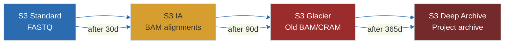

# 18 — AWS for Genomics: Cloud Infrastructure

**Prerequisites:** Basic AWS knowledge (S3, EC2), `16-nextflow-dsl2.md`, `17-containers-bioinformatics.md`

**See also:** `19-pipeline-integration.md`, `20-portfolio-career.md`

---

## The Big Idea

Genomics workloads are **embarrassingly parallel, data-intensive, and bursty**. AWS is built for this.

```
On-prem:        Buy 500 servers, use them 20% of the time.
Cloud (AWS):    Use 500 servers for 8 hours, pay for 8 hours.
```

---

## 1. Why AWS for Genomics

| Challenge | AWS Solution |
|-----------|-------------|
| Massive data (TB per genome) | S3 (virtually unlimited) |
| Parallel processing (1000s of cores) | Batch, EKS, EC2 Spot |
| Burst capacity (may need 1000 CPUs for 1 day) | Elastic scaling |
| Data sharing (multi-center) | S3 + IAM + VPC endpoints |
| Compliance (HIPAA, GxP) | Security/compliance programs |
| Cost management | Spot instances, lifecycle policies |

---

```
                              ┌───────────────────────┐
                              │    Internet Gateway   │
                              └──────┬──────────┬─────┘
                                     │          │
                    ┌────────────────┼──────────┼────────────────┐
                    │                │          │                │
                    │   ┌────────────┴────┐  ┌──┴──────────────┐ │
                    │   │  Public Subnet  │  │  Public Subnet  │ │
                    │   │  ┌──────────┐   │  │                 │ │
                    │   │  │   ALB    │   │  │                 │ │
                    │   │  └────┬─────┘   │  │                 │ │
                    │   │       │         │  │                 │ │
                    │   │  ┌────┴─────┐   │  │                 │ │
                    │   │  │ Bastion  │   │  │                 │ │
                    │   │  │   Host   │   │  │                 │ │
                    │   │  └──────────┘   │  │                 │ │
                    │   └─────────────────┘  └─────────────────┘ │
                    │                    VPC                     │
                    └────────────────────┬───────────────────────┘
                                         │
          ┌──────────────────────────────┼───────────────────────────┐
          │                              │                           │
  ┌───────┴──────────┐        ┌──────────┴─────────┐       ┌─────────┴────────┐
  │ Private Subnet 1 │        │  Private Subnet 2  │       │ Private Subnet 3 │
  │                  │        │                    │       │                  │
  │ ┌───────────┐    │        │  ┌──────────────┐  │       │ ┌──────────────┐ │
  │ │ AWS Batch │    │        │  │  HealthOmics │  │       │ │    RDS /     │ │
  │ │ Compute   │    │        │  │  (managed)   │  │       │ │   Aurora     │ │
  │ └───────────┘    │        │  └──────────────┘  │       │ └──────────────┘ │
  │ ┌───────────┐    │        │  ┌──────────────┐  │       │                  │
  │ │ ECS / EKS │    │        │  │  Container   │  │       │                  │
  │ │ Orchestr. │    │        │  │  Registry    │  │       │                  │
  │ └───────────┘    │        │  └──────────────┘  │       │                  │
  └───────┬──────────┘        └──────────┬─────────┘       └──────────────────┘
          │                              │
          └──────────────┬───────────────┘
                         │
          ┌──────────────┴───────────────────────────┐
          │   Amazon S3 (VPC Endpoint — no internet) │
          │   FASTQ in │ Work dir │ BAM/VCF out      │
          └──────────────┬───────────────────────────┘
                         │
          ┌──────────────┼──────────────┐
          │              │              │
  ┌───────┴───┐  ┌───────┴───┐  ┌───────┴───┐
  │  Amazon   │  │  Amazon   │  │CloudWatch │
  │   EFS     │  │   ECR     │  │ Logs +    │
  │ Reference │  │ Container │  │ Metrics   │
  │ Genomes   │  │  Images   │  │           │
  └───────────┘  └───────┬───┘  └───────────┘
                         │
          ┌──────────────┴───────────────┐
          │                              │
  ┌───────┴─────────┐          ┌─────────┴──────────┐
  │ ASP.NET Core    │          │    Nextflow        │
  │ Web Dashboard   │ <------- │ Workflow Engine    │
  │ (HTMX+Bootstrap)│          │ (Docker containers)│
  └─────────────────┘          └────────────────────┘
```

## 2. Core Services

### Amazon S3 — Storage

```bash
# Store FASTQ files
aws s3 cp sample.fastq.gz s3://genomics-bucket/raw/sample1/
aws s3 cp --recursive data/ s3://genomics-bucket/raw/

# Storage classes
aws s3 cp sample.bam s3://genomics-bucket/ --storage-class STANDARD
aws s3 cp old.bam s3://genomics-bucket/ --storage-class GLACIER

# Lifecycle policy (automate tiering)
# S3 → S3-IA (30 days) → Glacier (90 days) → Deep Archive (365 days)



**S3 storage strategy:**

```
s3://project-bucket/
  ├── raw/              (FASTQ, read-only, replicated)
  ├── aligned/          (BAM/CRAM, STANDARD while active)
  ├── variants/         (VCF, STANDARD while active)
  ├── qc/               (FastQC/MultiQC reports)
  ├── reference/        (Reference genomes, cached)
  └── logs/             (Pipeline logs)
```

### AWS Batch — Compute

AWS Batch is the easiest way to run Nextflow in the cloud:

```bash
# Resources needed:
# 1. Compute environment (EC2 instances)
# 2. Job queue (links compute environment to jobs)
# 3. Job definition (container + resources + command)

# Create compute environment (managed EC2)
aws batch create-compute-environment \
    --compute-environment-name genomics-spot \
    --type MANAGED \
    --compute-resources type=SPOT,minvCpus=0,maxvCpus=1000,desiredvCpus=0

# Create job queue
aws batch create-job-queue \
    --job-queue-name genomics-queue \
    --state ENABLED \
    --priority 1 \
    --compute-environment-order order=1,computeEnvironment=genomics-spot
```

### Amazon EFS / FSx — Shared Filesystem

```bash
# Mount EFS on all instances for reference genomes
sudo mount -t nfs4 -o nfsvers=4.1,rsize=1048576,wsize=1048576 \
    fs-xxxxx.efs.us-east-1.amazonaws.com:/ /reference
```

### AWS HealthOmics — Managed Genomics Service

```bash
# Purpose-built genomics service (higher abstraction than Batch)
aws omics start-run \
    --workflow-id <workflow-id> \
    --parameters key=value \
    --output-uri s3://results/
```

**Analogy:** HealthOmics is like Lambda for genomics — less control, less management. Batch is like EC2 — full control, more management.

---

## 3. Reference Genome Storage

Reference genomes are large (~30 GB each) and every pipeline needs them:

```bash
# Store reference in S3
aws s3 sync s3://genomics-references/hg38/ /reference/hg38/

# Typical reference files
/reference/hg38/
  ├── hg38.fa                  # ~3 GB
  ├── hg38.fa.fai              # FASTA index
  ├── hg38.dict                # Sequence dictionary
  ├── hg38.bwt                 # BWA index files
  ├── hg38.pac
  ├── hg38.ann
  ├── hg38.amb
  ├── dbsnp.vcf.gz             # Known variants (for BQSR)
  └── Mills_indels.vcf.gz      # Known indels
```

---

## 4. Spot Instances — Cost Optimization

Spot instances are **up to 90% cheaper** but can be terminated with 2 minutes notice:

```
On-demand (c5.4xlarge):  $0.68/hr
Spot (c5.4xlarge):       $0.10–0.20/hr (varies)
```

```bash
# Check spot pricing
aws ec2 describe-spot-price-history \
    --instance-types c5.4xlarge \
    --product-description "Linux/UNIX" \
    --start-time $(date -u +"%Y-%m-%dT%H:%M:%SZ")
```

### Handling Spot Interruptions

```yaml
# Nextflow automatically handles spot interruptions:
# - Requeues interrupted tasks
# - Uses checkpointing where possible
# - Configurable retry strategy

process {
    errorStrategy = 'retry'
    maxRetries = 3
    maxErrors = -1
    
    // Retry with more conservative resources
    withName: 'BWA_ALIGN' {
        errorStrategy = { task.exitStatus in 137,139 ? 'retry' : 'ignore' }
    }
}
```

---

## 5. Networking and Security

### VPC Architecture

```
                     ┌─────────────────────┐
                     │   Internet Gateway   │
                     └──────────┬──────────┘
                                │
                     ┌──────────┴──────────┐
                     │   Public Subnet      │
                     │    (NAT Gateway)     │
                     └──────────┬──────────┘
                                │
          ┌─────────────────────┼────────────────────┐
          │                     │                     │
 ┌────────┴────────┐  ┌────────┴────────┐  ┌─────────┴────────┐
 │ Private Subnet  │  │ Private Subnet  │  │ Private Subnet   │
 │ Batch compute   │  │ Batch compute   │  │ Batch compute    │
 │ (S3 VPC Endpoint)│  │ (S3 VPC Endpoint)│  │ (S3 VPC Endpoint)│
 └─────────────────┘  └─────────────────┘  └──────────────────┘
```

### S3 VPC Endpoint

```bash
# No data goes over the internet — faster, cheaper, more secure
aws ec2 create-vpc-endpoint \
    --vpc-id vpc-xxxx \
    --service-name com.amazonaws.us-east-1.s3 \
    --route-table-ids rtb-xxxx
```

---

## 6. IAM Roles

### Compute Role (for Batch instances)

```json
{
    "Version": "2012-10-17",
    "Statement": [
        {
            "Effect": "Allow",
            "Action": [
                "s3:GetObject",
                "s3:PutObject",
                "s3:ListBucket"
            ],
            "Resource": [
                "arn:aws:s3:::genomics-bucket/*",
                "arn:aws:s3:::genomics-references/*"
            ]
        },
        {
            "Effect": "Allow",
            "Action": [
                "ecr:GetDownloadUrlForLayer",
                "ecr:BatchGetImage",
                "ecr:BatchCheckLayerAvailability"
            ],
            "Resource": "*"
        }
    ]
}
```

---

## 7. Nextflow on AWS

### nextflow.config for AWS

```groovy
profiles {
    aws {
        process.executor = 'awsbatch'
        process.queue = 'genomics-queue'
        process.container = 'your-account.dkr.ecr.us-east-1.amazonaws.com/genomics-pipeline:latest'

        aws.region = 'us-east-1'
        aws.batch.cliPath = '/usr/local/bin/aws'

        // Work directory in S3
        workDir = 's3://genomics-bucket/work/'

        // Store outputs
        params.outdir = 's3://genomics-bucket/results/'
    }
}
```

### Running on AWS

```bash
# Run Nextflow on an EC2 instance or locally
nextflow run main.nf -profile aws

# Or use AWS HealthOmics for managed workflows
nextflow run nf-core/sarek \
    -profile singularity,aws \
    --input samplesheet.csv \
    --genome GRCh38 \
    -bucket-dir s3://my-bucket/work/
```

---

## 8. Cost Management

### Sample Cost Breakdown (30× WGS)

```
Resource              On-Demand    Spot
Compute (100 hrs)     $68          ~$10
S3 storage (30 days)  $12          $12
Data transfer (in)    Free         Free
Data transfer (out)   $20          $20
Total                 ~$100/sample ~$42/sample

With CRAM + lifecycle policies → even lower
```

### Cost Optimization Tips

```bash
# 1. Use Spot instances (up to 90% savings)
# 2. Compress with CRAM (not BAM, not BAM.gz)
# 3. S3 lifecycle: STANDARD → GLACIER after 30 days
# 4. Delete work directories after pipelines complete
# 5. Use S3 Intelligent-Tiering for active data
# 6. Batch jobs in same AZ → avoid cross-AZ data transfer
# 7. Reference genomes on EFS (shared, no re-download)
```

---

## 9. Monitoring and Logging

```bash
# CloudWatch Logs
aws logs describe-log-groups --log-group-name-prefix /aws/batch/

# Batch job status
aws batch list-jobs --job-queue genomics-queue --job-status RUNNABLE
aws batch describe-jobs --jobs <job-id>

# S3 storage
aws s3 ls s3://genomics-bucket/ --summarize

# Cost explorer (console)
# Cost allocation tags per sample/project
```

---

## Exercises

1. Set up an AWS Batch compute environment with Spot instances. What's the max vCPU you configured?
2. Write a `nextflow.config` that runs a pipeline on AWS Batch with S3 as the work directory.
3. Create S3 lifecycle policies: move raw FASTQ to Glacier after 30 days, delete work directories after 7 days.
4. Calculate the cost of running 100 30× WGS samples on AWS Batch using Spot instances vs on-demand.
5. Research: What is **AWS HealthOmics** and how does it differ from running Nextflow on Batch? When would you choose each?

---

## Key Terms

| Term | Definition |
|------|------------|
| AWS Batch | Managed batch computing service |
| Spot instance | Unused EC2 capacity at steep discount (may be interrupted) |
| S3 | Object storage for genomics data |
| EFS | NFS shared filesystem (good for reference genomes) |
| HealthOmics | Managed genomics service by AWS |
| VPC endpoint | Private connection to AWS services (no internet) |
| IAM | Identity and access management |
| Lifecycle policy | Auto-tier data between S3 storage classes |
| Work directory | Nextflow intermediate data storage location |

---

## Next Steps

→ `19-pipeline-integration.md` — End-to-end pipeline on AWS  
→ `20-portfolio-career.md` — Building the portfolio project  

---

*"The cloud turns genomics from a hardware problem into a cost-management problem."*
