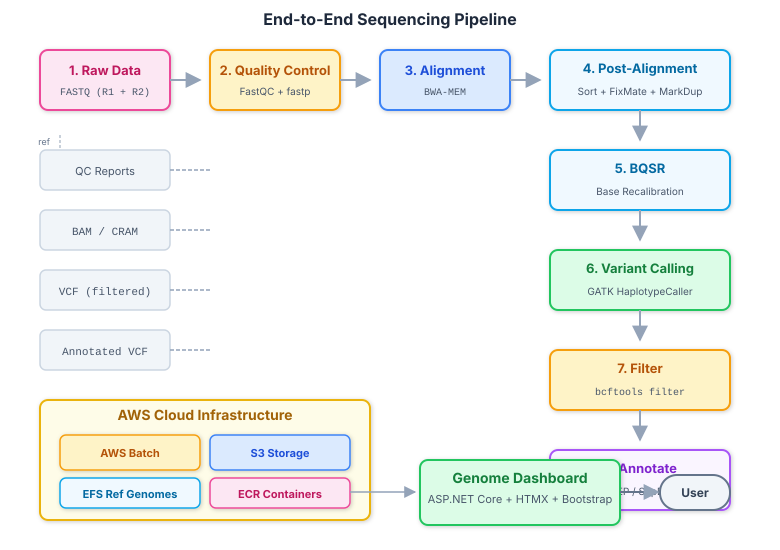
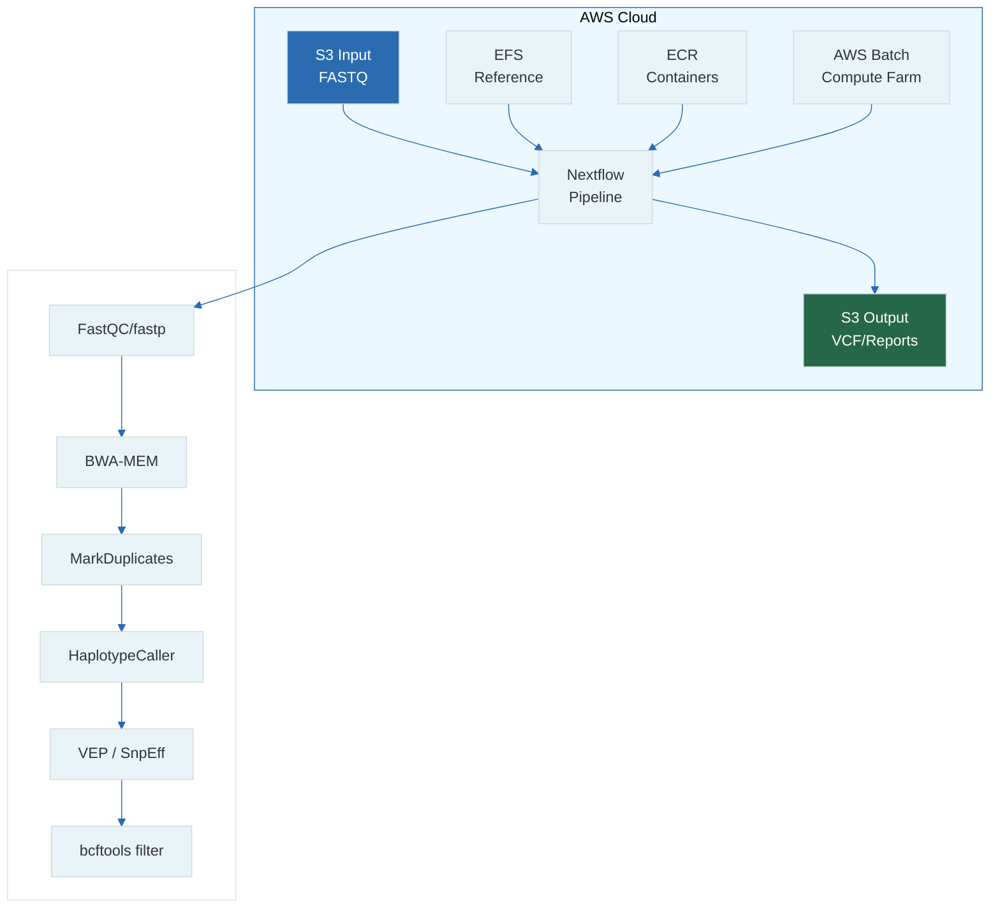

# 19 — Pipeline Integration: End-to-End Architecture

**Prerequisites:** All prior files (01–18)

**See also:** `20-portfolio-career.md`

---

## The Big Idea

An integrated genomics pipeline is a **data factory**: raw sequences go in, annotated variants come out, and every step is automated, monitored, and reproducible.



```
FASTQ → QC → Align → Dedup → BQSR → Call → Filter → Annotate → VCF
  │      │      │       │       │       │       │         │       │
  └──────┴──────┴───────┴───────┴───────┴───────┴─────────┴───────┘
                                                                  ↓
                                                           Web Dashboard
                                                           (ASP.NET Core)
```

---

## 1. Pipeline Architecture


│  └──────────────────────────────────────────────────────────┘ │
│                     │                                        │
│  ┌──────────────────▼──────────────────────────────────────┐ │
│  │              S3 Output Bucket                            │ │
│  │  BAM/CRAM, VCF, QC Reports, Logs                        │ │
│  └──────────────────────────────────────────────────────────┘ │
│                     │                                        │
│  ┌──────────────────▼──────────────────────────────────────┐ │
│  │         ASP.NET Core + HTMX Dashboard                    │ │
│  │  • List samples • View QC • Browse variants • Download  │ │
│  └──────────────────────────────────────────────────────────┘ │
└─────────────────────────────────────────────────────────────┘
```

---

## 2. Complete Nextflow Pipeline (`main.nf`)

```groovy
#!/usr/bin/env nextflow
nextflow.enable.dsl=2

// ===== PARAMETERS =====
params.reads = "s3://genomics-bucket/input/samplesheet.csv"
params.outdir = "s3://genomics-bucket/results/"
params.genome = "/ref/hg38/hg38.fa"
params.dbsnp = "/ref/hg38/dbsnp.vcf.gz"
params.known_indels = "/ref/hg38/Mills_indels.vcf.gz"
params.limit = null  // for testing: limit to N samples

// ===== MODULES =====
include { FASTQC } from './modules/fastqc'
include { FASTP } from './modules/fastp'
include { BWA_INDEX } from './modules/bwa_index'
include { BWA_ALIGN } from './modules/bwa_align'
include { SAMTOOLS_SORT } from './modules/samtools_sort'
include { MARKDUPLICATES } from './modules/markduplicates'
include { BQSR } from './modules/bqsr'
include { HAPLOTYPECALLER } from './modules/haplotypecaller'
include { VCF_FILTER } from './modules/vcf_filter'
include { VCF_ANNOTATE } from './modules/vcf_annotate'
include { MULTIQC } from './modules/multiqc'

// ===== WORKFLOW =====
workflow {
    // Read samplesheet
    samples = Channel.fromPath(params.reads)
        .splitCsv(header: true)
        .map { row -> tuple(row.sample_id, file(row.R1), file(row.R2)) }
    
    if (params.limit) samples = samples.take(params.limit as int)
    
    // Index reference (only once, cached)
    BWA_INDEX(file(params.genome))
    
    // Process each sample
    samples
        | map { sample_id, r1, r2 ->
            // QC
            FASTQC(r1, r2)
            FASTP(r1, r2)
            tuple(sample_id, FASTP.out.reads_R1, FASTP.out.reads_R2)
        }
        | map { sample_id, clean_r1, clean_r2 ->
            // Align
            BWA_ALIGN(sample_id, clean_r1, clean_r2, file(params.genome))
            SAMTOOLS_SORT(BWA_ALIGN.out.bam)
            MARKDUPLICATES(SAMTOOLS_SORT.out.bam)
            BQSR(MARKDUPLICATES.out.bam, file(params.genome), file(params.dbsnp), file(params.known_indels))
            
            // Call variants
            HAPLOTYPECALLER(BQSR.out.bam, file(params.genome))
            VCF_FILTER(HAPLOTYPECALLER.out.vcf)
            VCF_ANNOTATE(VCF_FILTER.out.vcf, file(params.genome))
            
            tuple(sample_id, BQSR.out.bam, VCF_ANNOTATE.out.vcf)
        }
        | collect
        | map { all_samples ->
            // Aggregate QC
            all_bams = all_samples.collect { it[1] }
            all_vcfs = all_samples.collect { it[2] }
            MULTIQC(all_bams, all_vcfs)
        }
}
```

## 3. Module Example: `modules/bwa_align.nf`

```groovy
process BWA_ALIGN {
    tag "${sample_id}"
    label 'bioinfo_16cpu'
    publishDir "${params.outdir}/bam", mode: 'copy', pattern: "*.bam"

    input:
    val(sample_id)
    path(r1)
    path(r2)
    path(genome)

    output:
    tuple val(sample_id), path("${sample_id}.bam"), emit: bam

    script:
    """
    bwa mem -t ${task.cpus} -R '@RG\\tID:${sample_id}\\tSM:${sample_id}\\tPL:ILLUMINA' \
        ${genome} ${r1} ${r2} > ${sample_id}.sam
    samtools view -bS ${sample_id}.sam > ${sample_id}.bam
    rm ${sample_id}.sam
    """
}
```

---

## 4. Samplesheet Format

```csv
sample_id,R1,R2
SAMPLE_001,s3://bucket/raw/SAMPLE_001_R1.fastq.gz,s3://bucket/raw/SAMPLE_001_R2.fastq.gz
SAMPLE_002,s3://bucket/raw/SAMPLE_002_R1.fastq.gz,s3://bucket/raw/SAMPLE_002_R2.fastq.gz
```

```bash
# Run full pipeline on 10 samples
nextflow run main.nf \
    --reads samplesheet.csv \
    --outdir s3://genomics-bucket/results/ \
    --limit 10 \
    -profile aws
```

---

## 5. Output Structure

```
s3://genomics-bucket/results/
  └── SAMPLE_001/
      ├── qc/
      │   ├── SAMPLE_001_fastqc.html
      │   ├── SAMPLE_001_fastp.html
      │   └── SAMPLE_001_multiqc.html
      ├── bam/
      │   ├── SAMPLE_001.bam
      │   └── SAMPLE_001.bam.bai
      ├── vcf/
      │   ├── SAMPLE_001.vcf.gz
      │   ├── SAMPLE_001.vcf.gz.tbi
      │   ├── SAMPLE_001.annotated.vcf.gz
      │   └── SAMPLE_001.annotated.vcf.gz.tbi
      ├── logs/
      │   ├── pipeline_trace.txt
      │   └── SAMPLE_001.bwa.log
      └── report/
          ├── SAMPLE_001_report.html
          └── SAMPLE_001_report.pdf
```

---

## 6. Monitoring & Alerting

```python
# Post-pipeline SNS notification (add to final process)
process SEND_NOTIFICATION {
    input:
    path(trace_file)

    script:
    """
    aws sns publish \
        --topic-arn arn:aws:sns:us-east-1:ACCOUNT:pipeline-complete \
        --message "Pipeline complete. Results in s3://bucket/results/" \
        --subject "WGS Pipeline: Complete"
    """
}
```

---

## 7. Cost Tracking Per Sample

```bash
# Tag resources with sample ID
aws batch submit-job \
    --job-name SAMPLE_001 \
    --job-queue genomics-queue \
    --job-definition genomics-pipeline:1 \
    --container-overrides environment=[{name=SAMPLE_ID,value=SAMPLE_001}]

# Via cost explorer, filter by tag:SAMPLE_ID
```

---

## 8. Pipeline Testing Strategy

```
Unit tests:
  - Each module tested in isolation with known test data
  - e.g., "does FASTQC produce an HTML file?"

Integration tests:
  - Full pipeline on 1 sample (downsampled to 1M reads)
  - Expected output files exist
  - Expected VCF has known variants

Validation tests:
  - Compare results to truth set (NA12878)
  - Precision/recall metrics for variants
  - Ti/Tv ratio in expected range

Regression tests:
  - Re-run with updated tools, compare VCFs
  - Check no variants "disappeared" or "appeared"
```

---

## 9. Local Testing Pipeline (Mini Version)

```groovy
// For development: test with tiny reference and 1000 reads
params.test = false

workflow {
    if (params.test) {
        // Use chr21 only, downsampled reads
        params.genome = "/ref/hg38/chr21.fa"
        
        Channel.of(["TEST", file("test_data/R1.fq.gz"), file("test_data/R2.fq.gz")])
            | ...same pipeline...
    }
}
```

```bash
# Quick test
nextflow run main.nf --test -profile docker
```

---

## 10. Deployment Automation (Terraform)

```hcl
# main.tf
resource "aws_batch_compute_environment" "genomics" {
  compute_environment_name = "genomics-spot"
  type                     = "MANAGED"
  
  compute_resources {
    type           = "SPOT"
    bid_percentage = 80
    min_vcpus      = 0
    max_vcpus      = 500
    desired_vcpus  = 0
    instance_types = ["c5.4xlarge", "c5.9xlarge", "r5.4xlarge"]
    security_group_ids = [aws_security_group.batch.id]
    subnets            = module.vpc.private_subnets
    
    tags = {
      Environment = "production"
      Service     = "genomics-pipeline"
    }
  }
}

resource "aws_s3_bucket" "genomics" {
  bucket = "genomics-platform-${var.environment}"
  
  lifecycle_rule {
    id      = "tier-data"
    enabled = true
    
    transition {
      days          = 30
      storage_class = "GLACIER"
    }
    
    expiration {
      days = 365
    }
  }
}
```

---

## Exercises

1. Write a complete Nextflow pipeline for WGS that includes: FastQC, BWA alignment, SAMtools sort, duplicate marking, BQSR, and HaplotypeCaller.
2. Design the S3 bucket structure for a multi-tenant genomics platform (different projects, samples, and access levels).
3. Create a Terraform module that deploys the AWS Batch infrastructure for this pipeline.
4. Implement a "mini pipeline" that runs on 1 sample with chr21 only and validates against a truth VCF.
5. Research: What is **Nextflow Tower** (or Seqera Platform) and how does it simplify multi-cloud pipeline management?

---

## Key Terms

| Term | Definition |
|------|------------|
| Pipeline integration | Connecting all pipeline stages into one automated workflow |
| Samplesheet | CSV/TSV listing input samples and their FASTQ paths |
| Module | Reusable, versioned Nextflow component |
| Validation | Testing pipeline correctness against truth data |
| Terraform | Infrastructure-as-code for AWS resources |
| Monitoring | Tracking pipeline progress, cost, and failures |
| Output structure | Organized storage of pipeline results |

---

## Next Steps

→ `20-portfolio-career.md` — Building the portfolio project and career strategy  

---

*"A pipeline is not a script — it's a system. Design it with the same rigor you'd use for a production web service."*
