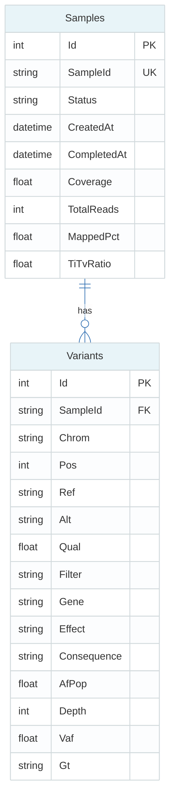
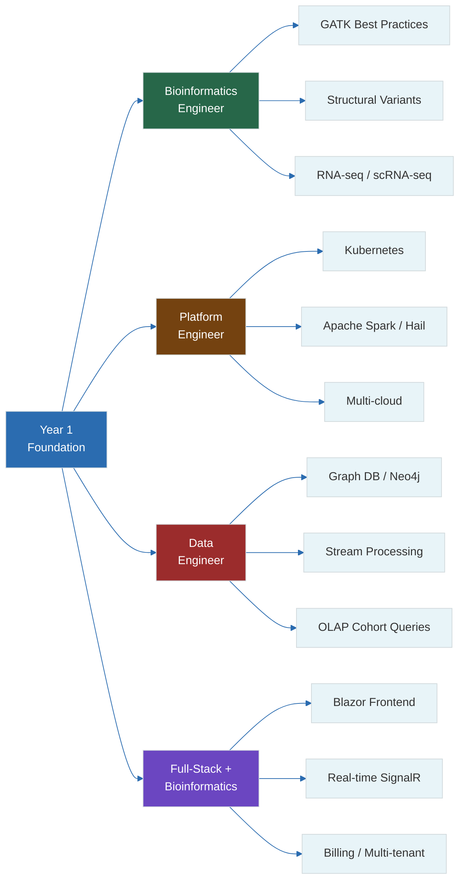

# 20 — Portfolio Project & Career Strategy

**Prerequisites:** All prior files (01–19). This is the capstone.

**See also:** `19-pipeline-integration.md`, `18-aws-genomics.md`

---

## The Big Idea

Your portfolio project is the **single most important artifact** for landing a high-paid bioinformatics/platform engineering role. It proves you can:

1. Understand the biology (DNA → variants)
2. Build production infrastructure (Nextflow + AWS)
3. Create a user-facing application (ASP.NET Core + HTMX + Bootstrap)

```
┌──────────────────────────────────────────────────────────────┐
│                                                              │
│   Portfolio Project — "Genome Dashboard"                     │
│                                                              │
│   Frontend (ASP.NET Core + HTMX + Bootstrap)                 │
│   ├── Sample list & status                                   │
│   ├── QC report viewer (MultiQC embeddings)                  │
│   ├── Variant browser (BED-like table with filters)          │
│   ├── Coverage visualization (per-chromosome bars)           │
│   └── Download links (BAM, VCF, report)                      │
│                                                              │
│   Backend (AWS + Nextflow)                                    │
│   ├── S3 for storage                                         │
│   ├── Nextflow for pipeline orchestration                   │
│   ├── AWS Batch for compute                                  │
│   └── SNS for notifications                                  │
│                                                              │
└──────────────────────────────────────────────────────────────┘
```

---

## 1. Project Overview

### Name

**GenomeDashboard** — Cloud-Native WGS Pipeline & Visualization Platform

### Tech Stack

| Layer | Technology | Why |
|-------|-----------|-----|
| Backend | ASP.NET Core 9 Minimal API / MVC | .NET ecosystem, fast, cross-platform |
| Frontend | HTMX + Bootstrap 5 | No JS framework needed, server-rendered |
| Database | SQLite (dev), PostgreSQL (prod) | Simple schemas, easy deployment |
| Compute | Nextflow + AWS Batch | Industry standard for genomics |
| Storage | Amazon S3 | Scalable, cheap, durable |
| Infrastructure | Terraform | Infrastructure-as-code |
| CI/CD | GitHub Actions | Automated testing + deployment |

### Features

```
1.  Upload samplesheet (CSV) or individual FASTQ
2.  Trigger WGS pipeline on AWS
3.  Real-time pipeline status (submitted → running → completed/failed)
4.  View QC reports (FastQC, MultiQC) in browser
5.  Browse variants with filtering (gene, quality, frequency)
6.  Coverage visualization by chromosome
7.  Download results (BAM, VCF, reports)
8.  User authentication (simple — proof of concept)
```

---

## 2. Architecture

### System Diagram

```
                    ┌──────────────┐
                    │   Browser    │
                    │  (HTMX)     │
                    └──────┬───────┘
                           │  HTTP / HTML
                    ┌──────↓───────┐
                    │  ASP.NET     │
                    │  Core Server │
                    └──────┬───────┘
                           │
          ┌────────────────┼────────────────┐
          │                │                │
   ┌──────↓──────┐  ┌──────↓──────┐  ┌──────↓──────┐
   │  S3         │  │  AWS Batch  │  │  SQLite/    │
   │  (FASTQ,    │  │  (Compute)  │  │  PostgreSQL │
   │   BAM, VCF) │  │             │  │  (Metadata) │
   └─────────────┘  └─────────────┘  └─────────────┘
                           │
                    ┌──────↓───────┐
                    │  Nextflow    │
                    │  Pipeline    │
                    └──────────────┘
```

### Database Schema



```sql
CREATE TABLE Samples (
    Id INTEGER PRIMARY KEY AUTOINCREMENT,
    SampleId TEXT NOT NULL UNIQUE,
    Status TEXT NOT NULL DEFAULT 'pending',  -- pending, running, completed, failed
    CreatedAt DATETIME DEFAULT CURRENT_TIMESTAMP,
    CompletedAt DATETIME,
    FastqR1 TEXT,
    FastqR2 TEXT,
    BamPath TEXT,
    VcfPath TEXT,
    ReportPath TEXT,
    Coverage FLOAT,
    TotalReads INTEGER,
    MappedPct FLOAT,
    TiTvRatio FLOAT
);

CREATE TABLE Variants (
    Id INTEGER PRIMARY KEY AUTOINCREMENT,
    SampleId TEXT NOT NULL,
    Chrom TEXT NOT NULL,
    Pos INTEGER NOT NULL,
    Ref TEXT NOT NULL,
    Alt TEXT NOT NULL,
    Qual REAL,
    Filter TEXT,
    Gene TEXT,
    Effect TEXT,           -- missense, nonsense, synonymous, etc.
    Consequence TEXT,       -- MODERATE, HIGH, etc.
    AfPop FLOAT,           -- population allele frequency
    Depth INTEGER,
    Vaf FLOAT,             -- variant allele frequency
    Gt TEXT,               -- genotype
    FOREIGN KEY (SampleId) REFERENCES Samples(SampleId)
);

CREATE INDEX idx_variants_sample ON Variants(SampleId);
CREATE INDEX idx_variants_gene ON Variants(Gene);
CREATE INDEX idx_variants_chrom_pos ON Variants(Chrom, Pos);
```

---

## 3. Implementation: ASP.NET Core

### Project Structure

```
GenomeDashboard/
├── GenomeDashboard.Api/           # Minimal API endpoints
│   ├── Program.cs
│   ├── Endpoints/
│   │   ├── SamplesEndpoints.cs
│   │   ├── VariantsEndpoints.cs
│   │   └── PipelineEndpoints.cs
│   ├── Services/
│   │   ├── PipelineService.cs       # Triggers Nextflow on AWS
│   │   ├── S3Service.cs            # Upload/download helpers
│   │   └── VariantService.cs       # Query VCF data
│   ├── Data/
│   │   ├── AppDbContext.cs
│   │   └── Migrations/
│   └── Models/
│       ├── Sample.cs
│       ├── Variant.cs
│       └── PipelineStatus.cs
├── GenomeDashboard.Web/            # HTMX + Bootstrap frontend
│   ├── Program.cs
│   ├── Pages/
│   │   ├── Index.cshtml            # Dashboard
│   │   ├── Samples.cshtml          # Sample list
│   │   ├── SampleDetail.cshtml     # Single sample details
│   │   ├── Variants.cshtml         # Variant browser
│   │   ├── Coverage.cshtml         # Coverage view
│   │   └── Upload.cshtml           # Upload samplesheet
│   ├── Components/                 # HTMX partial views
│   │   ├── _SampleTable.cshtml
│   │   ├── _VariantRow.cshtml
│   │   ├── _StatusBadge.cshtml
│   │   └── _CoverageBars.cshtml
│   └── wwwroot/
│       ├── css/
│       └── js/
└── GenomeDashboard.Tests/
```

### Key Endpoints

```csharp
// Program.cs — Minimal API
var builder = WebApplication.CreateBuilder(args);
builder.Services.AddDbContext<AppDbContext>(options =>
    options.UseSqlite("Data Source=genomics.db"));
builder.Services.AddScoped<PipelineService>();
builder.Services.AddScoped<S3Service>();
builder.Services.AddScoped<VariantService>();

var app = builder.Build();

// Samples
app.MapGet("/api/samples", async (AppDbContext db) =>
    await db.Samples.OrderByDescending(s => s.CreatedAt).ToListAsync());

app.MapGet("/api/samples/{id}", async (string id, AppDbContext db) =>
    await db.Samples.FirstOrDefaultAsync(s => s.SampleId == id)
    is Sample s ? Results.Ok(s) : Results.NotFound());

// Variants (paginated, filterable)
app.MapGet("/api/samples/{id}/variants", async (
    string id,
    int? page,
    string? gene,
    string? effect,
    AppDbContext db) =>
{
    var query = db.Variants.Where(v => v.SampleId == id);
    if (!string.IsNullOrEmpty(gene))
        query = query.Where(v => v.Gene == gene);
    if (!string.IsNullOrEmpty(effect))
        query = query.Where(v => v.Effect == effect);

    var total = await query.CountAsync();
    var items = await query
        .OrderBy(v => v.Chrom).ThenBy(v => v.Pos)
        .Skip((page ?? 0) * 100).Take(100)
        .ToListAsync();

    return Results.Ok(new { total, page, items });
});

// Coverage stats per chromosome
app.MapGet("/api/samples/{id}/coverage", async (string id, AppDbContext db) =>
{
    // Simplified — in production, query coverage from BAM or precomputed coverage file
    var samples = await db.Variants
        .Where(v => v.SampleId == id)
        .GroupBy(v => v.Chrom)
        .Select(g => new { Chrom = g.Key, Depth = g.Average(v => v.Depth) })
        .ToListAsync();
    return Results.Ok(samples);
});

// Trigger pipeline
app.MapPost("/api/pipeline/start", async (PipelineRequest request, PipelineService pipeline) =>
{
    var jobId = await pipeline.StartPipelineAsync(request.SampleId, request.R1, request.R2);
    return Results.Ok(new { jobId });
});

app.Run();
```

---

## 4. Implementation: HTMX Frontend

### Dashboard Page (`Pages/Samples.cshtml`)

```html
@model IEnumerable<Sample>
<div id="sample-list" class="container mt-4">
    <h2>Samples</h2>
    <table class="table table-striped table-hover">
        <thead>
            <tr>
                <th>Sample ID</th>
                <th>Status</th>
                <th>Coverage</th>
                <th>Mapped</th>
                <th>Ti/Tv</th>
                <th>Actions</th>
            </tr>
        </thead>
        <tbody hx-trigger="every 30s" hx-get="/samples/table" hx-target="#sample-table">
            @foreach (var sample in Model)
            {
                <tr>
                    <td><a href="/samples/@sample.SampleId">@sample.SampleId</a></td>
                    <td>
                        <span class="badge bg-@(sample.Status switch {
                            "completed" => "success",
                            "failed" => "danger",
                            "running" => "primary",
                            _ => "secondary"
                        })">@sample.Status</span>
                    </td>
                    <td>@sample.Coverage?.ToString("F1")×</td>
                    <td>@sample.MappedPct?.ToString("F1")%</td>
                    <td>@sample.TiTvRatio?.ToString("F2")</td>
                    <td>
                        <a href="/samples/@sample.SampleId/variants" class="btn btn-sm btn-outline-primary">Variants</a>
                        <a href="/samples/@sample.SampleId/coverage" class="btn btn-sm btn-outline-info">Coverage</a>
                    </td>
                </tr>
            }
        </tbody>
    </table>
</div>

<!-- Upload button (triggers page to update after upload) -->
<button hx-post="/pipeline/start" hx-target="#sample-list" class="btn btn-primary">
    New Pipeline Run
</button>
```

### Auto-Refreshing Status

```html
<!-- In SampleDetail.cshtml — auto-refreshing status badge -->
<div id="status-badge" hx-trigger="every 10s" hx-get="/samples/@Model.SampleId/status" hx-swap="outerHTML">
    <span class="badge bg-primary">@Model.Status</span>
</div>

<!-- Only refresh while running/pending — stop after complete -->
<script>
    document.body.addEventListener('htmx:beforeSwap', function(evt) {
        if (evt.detail.target.id === 'status-badge') {
            var status = evt.detail.serverResponse;
            if (status === 'completed' || status === 'failed') {
                // Stop auto-refresh by removing the trigger
                document.getElementById('status-badge')
                    .removeAttribute('hx-trigger');
            }
        }
    });
</script>
```

---

## 5. Implementation: AWS Pipeline Service

```csharp
public class PipelineService
{
    private readonly IAmazonBatch _batch;
    private readonly IAmazonS3 _s3;
    private readonly IConfiguration _config;

    public PipelineService(IAmazonBatch batch, IAmazonS3 s3, IConfiguration config)
    {
        _batch = batch;
        _s3 = s3;
        _config = config;
    }

    public async Task<string> StartPipelineAsync(string sampleId, string r1Url, string r2Url)
    {
        var jobDefinition = _config["AWS:Batch:JobDefinition"];
        var jobQueue = _config["AWS:Batch:JobQueue"];

        var response = await _batch.SubmitJobAsync(new SubmitJobRequest
        {
            JobName = $"pipeline-{sampleId}",
            JobDefinition = jobDefinition,
            JobQueue = jobQueue,
            ContainerOverrides = new ContainerOverrides
            {
                Environment = new List<KeyValuePair<string, string>>
                {
                    new("SAMPLE_ID", sampleId),
                    new("R1_URL", r1Url),
                    new("R2_URL", r2Url),
                    new("OUTPUT_BUCKET", _config["AWS:S3:OutputBucket"]),
                }
            }
        });

        return response.JobId;
    }

    public async Task<PipelineStatus> GetStatusAsync(string jobId)
    {
        var response = await _batch.DescribeJobsAsync(new DescribeJobsRequest
        {
            Jobs = new List<string> { jobId }
        });

        if (response.Jobs.Count == 0)
            return PipelineStatus.Unknown;

        var job = response.Jobs[0];
        return job.Status.Value switch
        {
            JobStatus.SUBMITTED => PipelineStatus.Submitted,
            JobStatus.PENDING => PipelineStatus.Submitted,
            JobStatus.RUNNABLE => PipelineStatus.Submitted,
            JobStatus.STARTING => PipelineStatus.Running,
            JobStatus.RUNNING => PipelineStatus.Running,
            JobStatus.SUCCEEDED => PipelineStatus.Completed,
            JobStatus.FAILED => PipelineStatus.Failed,
            _ => PipelineStatus.Unknown
        };
    }
}
```

---

## 6. Implementation: HTMX Variant Browser

```html
<!-- Variants.cshtml — Filterable, paginated variant table -->
<div class="container mt-4">
    <h2>Variants — @Model.SampleId</h2>

    <!-- Filters -->
    <div class="row mb-3">
        <div class="col">
            <input type="text" class="form-control" placeholder="Gene (e.g., TP53)"
                   name="gene" hx-get="/samples/@Model.SampleId/variants"
                   hx-trigger="keyup changed delay:500ms" hx-target="#variant-table">
        </div>
        <div class="col">
            <select class="form-select" name="effect"
                    hx-get="/samples/@Model.SampleId/variants"
                    hx-trigger="change" hx-target="#variant-table">
                <option value="">All Effects</option>
                <option value="missense">Missense</option>
                <option value="nonsense">Nonsense</option>
                <option value="synonymous">Synonymous</option>
                <option value="frameshift">Frameshift</option>
            </select>
        </div>
        <div class="col">
            <input type="number" class="form-control" placeholder="Min QUAL"
                   name="minQual" hx-get="/samples/@Model.SampleId/variants"
                   hx-trigger="change" hx-target="#variant-table">
        </div>
    </div>

    <!-- Variant table (auto-refreshed by HTMX) -->
    <div id="variant-table" hx-get="/samples/@Model.SampleId/variants?page=0" hx-trigger="load">
        @await Html.PartialAsync("_VariantTable", Model.Variants)
    </div>
</div>
```

### Partial: `_VariantTable.cshtml`

```html
@model VariantPageModel
<table class="table table-sm table-striped">
    <thead>
        <tr>
            <th>CHROM</th>
            <th>POS</th>
            <th>REF</th>
            <th>ALT</th>
            <th>QUAL</th>
            <th>FILTER</th>
            <th>GENE</th>
            <th>EFFECT</th>
            <th>VAF</th>
            <th>DP</th>
            <th>GT</th>
        </tr>
    </thead>
    <tbody>
        @foreach (var v in Model.Variants)
        {
            <tr class="@(v.Effect switch {
                "nonsense" => "table-danger",
                "frameshift" => "table-danger",
                "missense" => "table-warning",
                _ => ""
            })">
                <td>@v.Chrom</td>
                <td>@v.Pos.ToString("N0")</td>
                <td>@v.Ref</td>
                <td>@v.Alt</td>
                <td>@v.Qual?.ToString("F0")</td>
                <td>@v.Filter</td>
                <td>@v.Gene</td>
                <td>@v.Effect</td>
                <td>@v.Vaf?.ToString("P1")</td>
                <td>@v.Depth</td>
                <td>@v.Gt</td>
            </tr>
        }
    </tbody>
</table>

<!-- Pagination -->
<nav>
    <ul class="pagination">
        @for (int i = 0; i < Model.TotalPages; i++)
        {
            <li class="page-item @(i == Model.Page ? "active" : "")">
                <button class="page-link" hx-get="/samples/@Model.SampleId/variants?page=@i"
                        hx-target="#variant-table">
                    @(i + 1)
                </button>
            </li>
        }
    </ul>
</nav>
```

---

## 7. Coverage Visualization (Bootstrap + CSS)

```html
<!-- Coverage.cshtml — Per-chromosome coverage bars -->
<div class="container mt-4">
    <h2>Coverage — @Model.SampleId</h2>
    <p>Mean coverage: <strong>@Model.MeanCoverage.ToString("F1")×</strong></p>

    <div class="coverage-chart">
        @foreach (var chrom in Model.ChromosomeCoverage)
        {
            var pct = chrom.Coverage / Model.MaxCoverage * 100;
            <div class="row mb-1">
                <div class="col-2 text-end">@chrom.Chrom</div>
                <div class="col-8">
                    <div class="progress" style="height: 20px;">
                        <div class="progress-bar bg-@(chrom.Coverage switch {
                            var c when c < 10 => "danger",
                            var c when c < 20 => "warning",
                            _ => "success"
                        })" style="width: @pct%">
                            @chrom.Coverage.ToString("F1")×
                        </div>
                    </div>
                </div>
            </div>
        }
    </div>
</div>
```

---

## 8. GitHub Repository Structure

```
genome-dashboard/
├── .github/
│   └── workflows/
│       ├── build-test.yml           # CI: build + test .NET
│       ├── deploy-aws.yml           # CD: deploy to EC2/ECS
│       └── docker-build.yml         # Build + push containers
├── src/
│   ├── GenomeDashboard.Api/
│   ├── GenomeDashboard.Web/
│   └── GenomeDashboard.Shared/
├── pipeline/
│   ├── main.nf                      # Nextflow pipeline
│   ├── modules/                     # Nextflow modules
│   ├── nextflow.config
│   └── test_data/                   # Small test dataset
├── infra/
│   ├── main.tf                      # Terraform: Batch, S3, IAM
│   ├── variables.tf
│   └── outputs.tf
├── docker/
│   ├── Dockerfile.pipeline
│   └── Dockerfile.web
├── docs/
│   ├── architecture.md
│   └── deployment.md
├── tests/
│   ├── GenomeDashboard.Tests/
│   └── pipeline-test.sh
├── README.md
└── LICENSE
```

---

## 9. Interview Preparation

### Common Interview Questions

**Biology:**
- Explain the central dogma. What happens if the reading frame shifts?
- What's the difference between germline and somatic mutations?
- Why does Ti/Tv ratio differ between WGS and WES?
- What causes GC bias in sequencing?

**Bioinformatics:**
- How does BWA-MEM alignment work? What's an FM-index?
- What's in a CIGAR string? Give three examples.
- When would you use CRAM instead of BAM?
- How do you filter a VCF to find rare pathogenic missense variants?

**Engineering:**
- How would you design a scalable genomics pipeline on AWS?
- How do you handle spot instance interruptions in Nextflow?
- How would you store and query millions of variants efficiently?
- Explain the architecture of your GenomeDashboard project.

**System Design:**
- Design a system that processes 10,000 WGS genomes per year.
- How would you reduce storage costs for genomics data?
- How would you handle multi-tenant access to genomic data?

### Resume Keywords

```
Bioinformatics, Genomics, WGS, WES, RNA-seq
Nextflow, nf-core, Workflow Automation
AWS Batch, S3, EC2, EKS, HealthOmics
Docker, Singularity, Containerization
BWA, Minimap2, SAMtools, BCFtools, FastQC
VCF, BAM, CRAM, FASTQ, BED, GFF
ASP.NET Core, HTMX, Bootstrap, C#
Terraform, GitHub Actions, CI/CD
Variant Calling, Annotation, Filtering
```

---

## 10. Year 2 Roadmap

After completing the Year 1 curriculum, you'll have a foundation to specialize:



```
Year 2 Options:

  Bioinformatics Engineer (deeper pipeline expertise):
    - Learn GATK Best Practices (germline + somatic)
    - Master structural variant callers (Manta, Delly, SvABA)
    - RNA-seq differential expression (DESeq2, edgeR)
    - Single-cell RNA-seq (Cell Ranger, Seurat)
    - Machine learning for variant prioritization

  Platform/Infrastructure Engineer (deeper cloud/ops):
    - Kubernetes for genomics (EKS, KubeFlow)
    - Apache Spark for large-scale variant analysis (Glow, Hail)
    - Data lake architectures (Delta Lake, Apache Iceberg)
    - Multi-cloud (Azure Genomics, GCP Life Sciences)
    - Regulatory compliance (HIPAA, CLIA, CAP)

  Data Engineer (deeper data systems):
    - Graph databases for knowledge graphs (Neo4j)
    - Feature stores for ML on genomic data
    - Stream processing (Kafka for real-time genomics?)
    - Data quality frameworks
    - OLAP for cohort queries

  Full-Stack + Bioinformatics (entrepreneur/startup):
    - Deepen ASP.NET Core / Blazor frontend
    - Add real-time updates (SignalR for pipeline logs)
    - Build analysis-as-a-service platform
    - User management, billing, roles
```

---

## 11. Job Titles & Salary Ranges

```
Role                                   Entry        3+ Years
───────────────────────────────────────────────────────────
Bioinformatics Engineer               $90–120k     $130–170k
Bioinformatics Software Engineer      $100–130k    $140–180k
Platform Engineer (Genomics)          $110–140k    $150–200k
Genomics Data Engineer                $100–130k    $140–180k
Computational Biologist              $85–110k     $120–160k
Senior Bioinformatics Scientist       $120–150k    $160–220k
Principal Engineer (Genomics)         —            $200–300k+
```

Companies hiring: Illumina, PacBio, 10x Genomics, Broad Institute, Genentech, Regeneron, Color, Tempus, Foundation Medicine, Amazon HealthOmics, Google DeepVariant, Microsoft BioGPT, and most major hospital systems.

---

## 12. Project Demo Checklist

By the end of this curriculum and project, you should be able to:

```
□ Explain DNA → RNA → Protein to a non-technical person
□ Describe how Illumina sequencing works
□ Run FastQC and interpret the results
□ Align reads with BWA and explain the CIGAR
□ Convert between SAM/BAM/CRAM and explain trade-offs
□ Call variants with bcftools
□ Annotate and filter a VCF
□ Write a Nextflow pipeline with at least 5 processes
□ Containerize the pipeline with Docker
□ Deploy the pipeline on AWS Batch
□ Build an ASP.NET Core + HTMX + Bootstrap dashboard
□ Show a variant table with filtering in your dashboard
□ Walk through your architecture diagram
□ Answer "Why BAM instead of SAM?" in an interview
```

---

## Exercises

1. Build the complete `GenomeDashboard` project (or a subset). Deploy it to a free-tier AWS account.
2. Write a blog post explaining your architecture. Publish it on LinkedIn or Dev.to.
3. Record a 5-minute video walking through your pipeline and dashboard. Upload to YouTube.
4. Contribute to an nf-core pipeline (documentation, bug fix, or module).
5. Do a mock interview with a friend — ask each other the questions in section 9.

---

## Key Terms

| Term | Definition |
|------|------------|
| Portfolio project | A deployable system demonstrating all your skills |
| HTMX | Library for dynamic HTML without JavaScript frameworks |
| ASP.NET Core | Microsoft's cross-platform web framework |
| Minimal API | Lightweight HTTP API endpoints in .NET |
| Bootrstrap | CSS framework for responsive design |
| Terraform | Infrastructure-as-code tool |
| Capstone | The final, integrative project of a curriculum |
| Specialization | Deeper expertise in one area after broad foundation |

---

## Final Thoughts

> "Genomics is the first domain where the data scale problem met modern software engineering — and the people who bridge both worlds are invaluable."

You've covered:
- **Molecular biology** through a software lens
- **Sequencing technology** and its error modes
- **File formats** that handle petabytes of data
- **Alignment and variant calling** algorithms
- **Workflow automation** with Nextflow
- **Cloud infrastructure** for elastic computing
- **Full-stack development** for user-facing dashboards

This combination — biology + software + cloud — is rare and highly valued.

---

## Next Steps

→ Review any weak areas from `README.md`  
→ Start building the portfolio project  
→ Apply for bioinformatics/platform engineering roles  
→ Begin Year 2 specialization  

---

*"The genome is the largest codebase in existence. Treat it with respect — and version control."*
